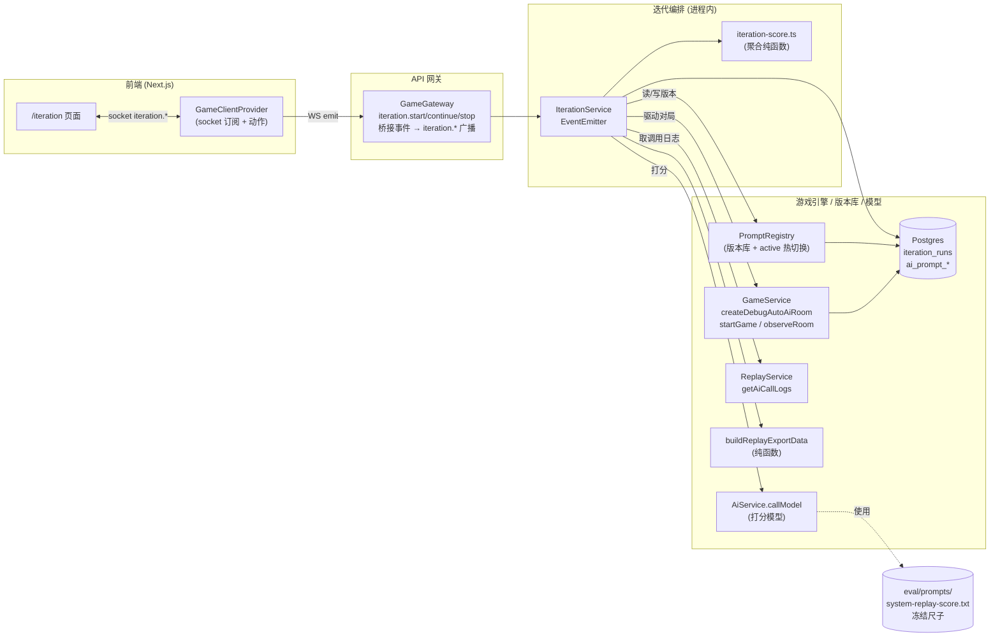
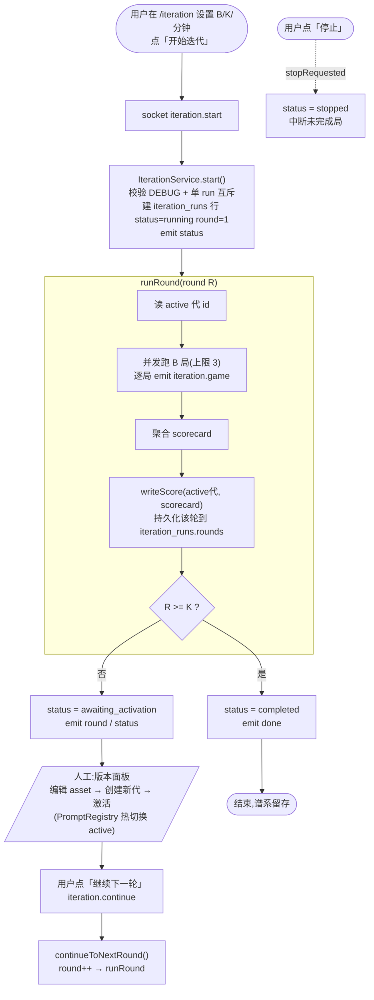
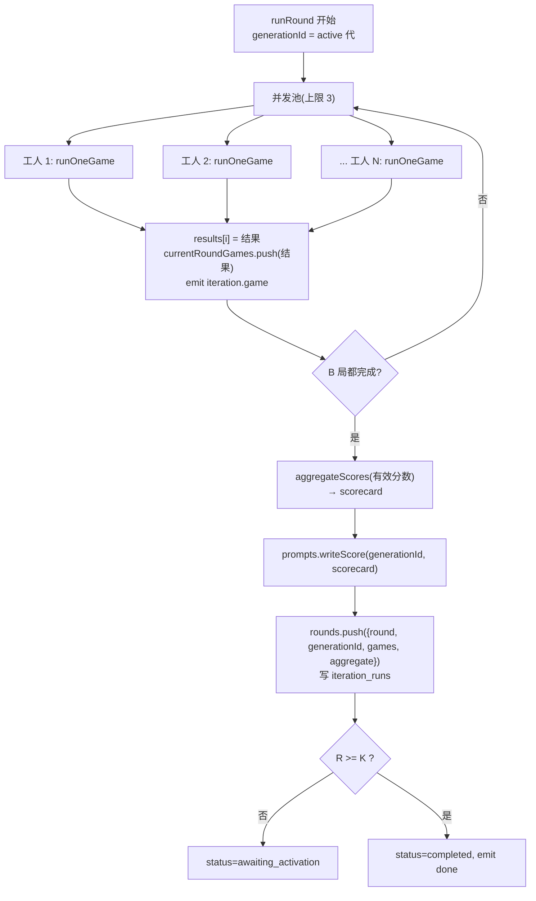
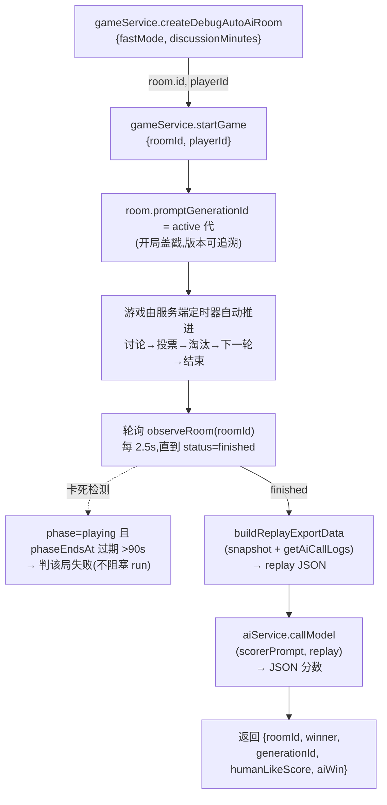
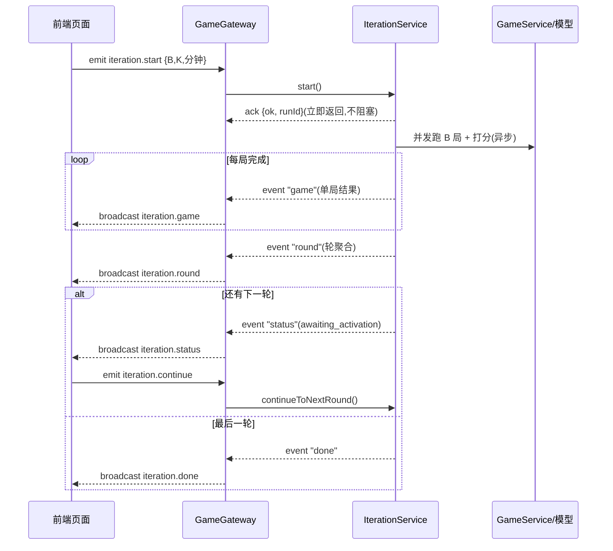
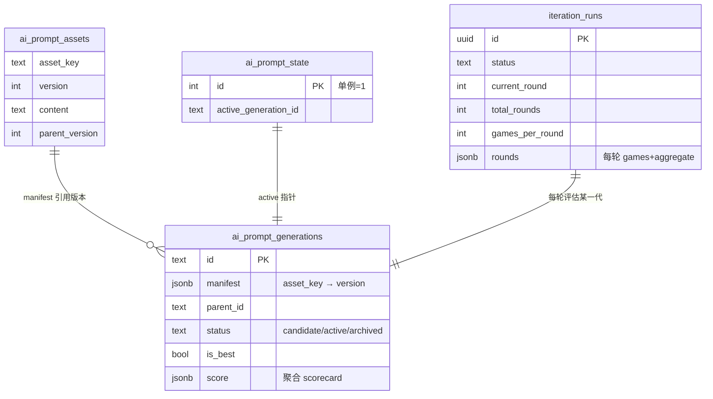

# 自动对局评估自迭代 · 流程说明

> 本文聚焦**整体流程与运行逻辑**,配合流程图说明「自动对局评估自迭代」如何运转。
> 设计动机与取舍见 [`AI-Prompt-Eval-Loop.md`](./AI-Prompt-Eval-Loop.md);拟人化迭代记录见 [`AI-human-like.md`](./AI-human-like.md)。

## 一句话概览

点击「开始迭代」→ 服务端**进程内**用当前提示词版本跑一批无头对局 → 用**冻结的打分尺子**逐局量化打分 → 聚合成 scorecard → 轮间由人工在页面上创建/激活新版本 → 继续下一轮,循环 K 轮。全程实时可见进度,版本可一键回滚。

---

## 一、组件总览



关键点:
- **对局在进程内跑完**:`IterationService` 直接调 `GameService.createDebugAutoAiRoom + startGame`,纯服务端定时器推进(讨论→投票→淘汰→下一轮→结束),**不需要 socket 客户端**。
- **IterationService 不碰 socket**:它用 `EventEmitter` 发本地事件,由 `GameGateway` 桥接成 `iteration.*` 广播,保持可测试、解耦。
- **打分尺子冻结**:scorer 提示词按绝对路径加载,**不进版本库**,确保跨版本打分可比。

---

## 二、核心概念

| 概念 | 说明 |
| --- | --- |
| **代(generation)** | 一组提示词版本的快照(6 个文本模板 + 人格库 JSON 的各一个版本号)。`ai_prompt_generations` 一行。 |
| **active 代** | 当前线上对局实际使用的代,由 `ai_prompt_state` 单例指针指定。**热切换**:改指针即生效,无需重启。 |
| **run** | 一次「开始迭代」到「完成/停止」的过程,含 K 轮。`iteration_runs` 一行。 |
| **轮(round)** | 用当前 active 代跑 B 局 → 打分 → 聚合。轮与轮之间进入 `awaiting_activation` 等待人工换版本。 |
| **scorecard** | 一轮 B 局分数的聚合(胜率、humanLikeScore 均值±标准误、各 tell 命中率、高频问题)。 |

---

## 三、整体迭代流程(主循环)



要点:
- **评估循环自动跑,版本激活人工操作**(本期不做自动编辑器,`IterationService` 预留 `editor` 钩子)。
- 不强制换版本:保持同一代继续跑,只是为该代累积更多样本、分数会更稳。
- **单进程互斥**:同时只允许一个 run(active 代是进程级单例)。

---

## 四、单轮内部流程(B 局并发)



---

## 五、单局流程(对局驱动 + 打分)



说明:
- **版本感知**:每局开局盖戳 `promptGenerationId`;复盘分析时注入「该局当时跑的那一代」的提示词,不张冠李戴。
- **卡死兜底**:服务端进程若在对局中途重启(如 `nest --watch` 重编译),内存定时器丢失会致对局卡住;单局判失败并记 `error`,不影响整轮。

---

## 六、打分与聚合(冻结尺子)

打分提示词 `eval/prompts/system-replay-score.txt` **固定不变**,对每局 replay 输出严格 JSON:

```json
{
  "aiWin": true,
  "aiSurvivors": 2,
  "roundsPlayed": 4,
  "humanLikeScore": 78,
  "naturalnessAiVsHuman": 4,
  "voteThreatTargeting": 4,
  "tells": {
    "round1PushVote": 0, "singleCharWhenNamed": 0, "sampleLineCopy": 0,
    "lockstepBlockVote": 1, "formulaicVoteReason": 0, "teammateMisfire": 0,
    "postProvocationSkip": 0, "templatePhrase": 1
  },
  "topIssues": ["..."]
}
```

`aggregateScores(scores)` 聚合成 scorecard:AI 胜率、`humanLikeScore` 均值±标准误、各 tell 的总命中次数与命中对局占比、高频 topIssues。聚合分回写该代(`ai_prompt_generations.score`),谱系面板即可看到每代分数。

---

## 七、实时事件流



- 前端首屏与断线重连走 `GET /debug/iterations`(返回当前/最近 run 快照)兜底。
- 事件:`iteration.status`(全量快照)、`iteration.game`(单局)、`iteration.round`(轮聚合)、`iteration.done`。

---

## 八、数据模型



---

## 九、关键配置与常量

| 常量 | 默认值 | 说明 |
| --- | --- | --- |
| `DEFAULT_ROUNDS` (K) | 4 | 一个 run 的轮数 |
| `DEFAULT_GAMES_PER_ROUND` (B) | 6 | 每轮局数 |
| `DEFAULT_DISCUSSION_MINUTES` | 1 | 每轮讨论时长(分钟) |
| `GAME_CONCURRENCY` | 3 | 单轮内并发对局上限 |
| `POLL_INTERVAL_MS` | 2500 | 轮询对局完成间隔 |
| `STUCK_AFTER_MS` | 90000 | 卡死判定阈值 |

环境变量:
- `DEBUG=true`:开启 debug 自动对局与迭代入口。
- `REPLAY_ANALYSIS_BASE_URL/API_KEY/MODEL`:打分模型(OpenAI 兼容)。
- `EVAL_SCORE_PROMPT_PATH`:冻结尺子路径(默认依次尝试 `cwd/eval/prompts/...` 与 `__dirname` 回退)。

---

## 十、使用方式

**前端 `/iteration` 页面(唯一入口)**
设置 B/K/时长 → 开始迭代 → 实时看进度 → 轮间在「版本谱系与激活」面板:左侧选版本、右侧查看/编辑提示词、「与父代对比」看差异(高亮增删行)→ 创建新代 → 激活 → 继续下一轮。

版本管理动作背后调用的是 DEBUG 网关的 HTTP 接口:`GET /debug/prompts/generations`、`GET /debug/prompts/generations/:id`、`POST /debug/prompts/generation`、`POST /debug/prompts/active`、`POST /debug/prompts/best`、`POST /debug/prompts/score`(均在 `apps/api/src/ai/prompt-version.controller.ts`)。

> 入口在首页 `{debug && ...}` 门控,需 `DEBUG=true` 且 API 在运行。
