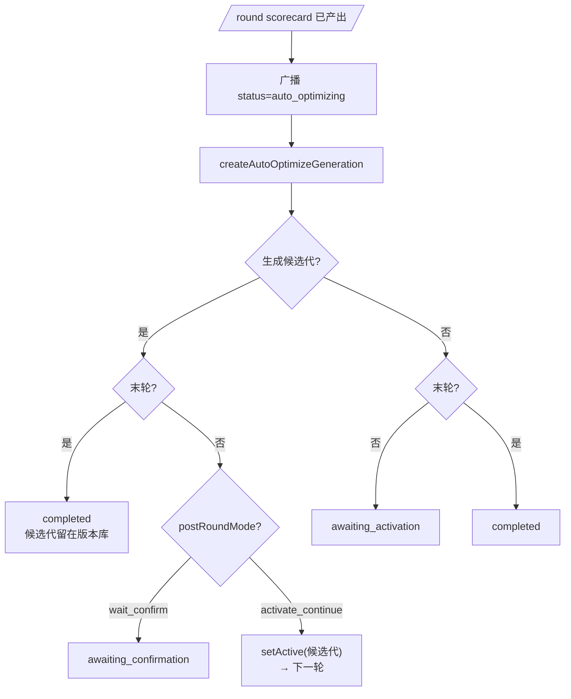

# AI 提示词自动对局评估自迭代 · 自动优化器

| 字段 | 内容 |
| --- | --- |
| 文档类型 | Design |
| 文档状态 | Active |
| 适用范围 | 自动对局评估自迭代中的单局打分、轮聚合 scorecard、自动优化器、轮后状态流转与详情重建 |
| 目标读者 | 后端开发、评审者 |
| 责任人 | AI / Evaluation 维护者 |
| 最近核对日期 | 2026-06-16 |
| 关联代码 | `apps/api/src/iteration/`、`apps/api/src/ai/`、`apps/web/app/iteration/` |
| 关联文档 | [AI-Prompt-Eval.md](./AI-Prompt-Eval.md)、[AI-Prompt-Eval-Flow.md](./AI-Prompt-Eval-Flow.md)、[AI-Prompt-Eval-Details.md](./AI-Prompt-Eval-Details.md)、[Replay-Analysis.md](./Replay-Analysis.md) |

这篇是打分与自动优化器的单独维护点。以后只要修改单局打分、scorecard 聚合、自动优化器的实现逻辑、状态流转、请求重建或重试策略，优先改这里，不需要同步改 Flow / Details 的实现细节。

## 1. 作用范围

自动优化器发生在每轮 `scorecard` 产出之后，由 `IterationService.createAutoOptimizeGeneration` 负责，把本轮 scorecard、逐局摘要和当前代 assets 交给优化模型，生成新的候选代。

它只处理这几件事:

- 读取本轮实际运行的 AI 代。
- 锁定本轮使用的评估尺子代。
- 组装优化器 system / user prompt。
- 调模型、校验返回、派生候选代。
- 写入 `IterationRound.autoOptimize` 的留痕字段。
- 驱动轮后状态流转和前端展示。

## 2. 单局打分

每局对局跑完后,`IterationService.runOneGame` 调 `scoreReplay(replay)` 给这局打分。

### 2.1 打分链路

1. **锁定本局使用的评估尺子代**: `runOneGame()` 在进入 `scoreReplay()` 前读取 `evalPrompts.getActiveGenerationId()` 得到 `scoreGenerationId`,并写入 `IterationGameResult.scoreGenerationId`。这一步保证“该局到底用哪套打分尺子打的分”可追溯。
2. **构造 user 消息**(`buildScoreUserPrompt`):取该局的 `promptGenerationId`(盖戳于开局),按该 AI 代取**人格定义**(`getPersonasForGeneration` → `PromptRegistry.getGenerationAssets`,按 genId 缓存),只保留 `id / name / sampleLines / avoidPhrases`;再从该 `scoreGenerationId` 对应的评估尺子代读取 `replay-score/user-replay-score-template.txt`,把「复盘 JSON」和「人格定义」渲染成 user 消息。
3. **加载 system 尺子**: `scoreReplay()` 从同一个 `scoreGenerationId` 读取 `replay-score/system-replay-score.txt`。因此 system / user 两段提示词始终来自**同一个评估 generation**,不会混用当前 active 与历史版本。
4. **调用打分模型**(`aiService.callModel`,非流式,OpenAI 兼容):`callModel(systemPrompt, userPrompt, modelConfig, options)`。
5. **解析**(`parseJsonObject`):容错剥 ```` ```json ```` 围栏 / 截首个 `{...}`,失败则该局记 `error`(不进聚合)。
6. 整份打分挂到 `IterationGameResult.score`,供第 3 节聚合;`humanLikeScore/aiWin` 另存为顶层字段供前端逐局卡片显示。

补充:

- `GET /debug/iterations/score-request/:roomId` 重建历史请求时,优先回查该局记录下来的 `scoreGenerationId`;只有缺失时才回退当前 active 评估尺子代。
- `getScorerPrompt()` 返回的是**当前 active 评估尺子代**里的 `replay-score/system-replay-score.txt`,用于前端展示“此刻线上默认会怎么打分”,不是历史回放接口。

### 2.2 打分模型配置

复用复盘分析那套 **`REPLAY_ANALYSIS_*`** 环境变量(不是 AI 玩家的模型),由 `resolveScoreModel()` 解析。下表只列环境变量与**代码默认值**;实际取值以 `.env` 为准。

| 项 | 环境变量 | 代码默认 |
|---|---|---|
| baseURL | `REPLAY_ANALYSIS_BASE_URL` | (必填,无默认) |
| model | `REPLAY_ANALYSIS_MODEL` | (必填,无默认) |
| apiKey | `REPLAY_ANALYSIS_API_KEY` | (必填,无默认) |
| temperature | `REPLAY_ANALYSIS_TEMPERATURE` | `0.2` |
| reasoningEffort | `REPLAY_ANALYSIS_REASONING_EFFORT` | `high` |
| thinking | `REPLAY_ANALYSIS_THINKING`(bool,true/1/yes/on → 启用) | `true` |
| timeout | `REPLAY_ANALYSIS_TIMEOUT_MS` | `SCORE_TIMEOUT_MS = 120000` |
| 请求格式 | `modelConfig.format` 未设 → `openai` | `POST {baseURL}/chat/completions`,`Bearer` 鉴权 |

请求体:`{ model, temperature, messages:[{system}, {user}], thinking:{type:"enabled"}, reasoning_effort }`(thinking 仅在 `thinking !== false` 时带)。**不强制 `response_format:json_object`**,靠 system 指令 + 容错解析兜。

### 2.3 system 尺子 `replay-score/system-replay-score.txt`

运行时读取的是**当前或指定 `scoreGenerationId` 的版本库内容**;`eval/prompts/system-replay-score.txt` 只是首启播种/缺省回退来源。该 prompt 要求只输出固定两段文本:`[[score]]` 和 `[[analysis]]`。代码只解析 `[[score]]`;`[[analysis]]` 原样留给详情页和自动优化器。

```text
[[score]]
human_like_score: 72
naturalness_ai_vs_human: 3
vote_threat_targeting: 2
issue_counts: TEMPLATE_PHRASE=4, FORMULAIC_VOTE_REASON=2, WEAK_SUSPICION=3
primary_issue_codes: TEMPLATE_PHRASE, WEAK_SUSPICION
confidence: medium

[[analysis]]
summary: 前两轮能跟局,但怀疑理由长期停留在模板话术,缺少可核查证据。
evidence:
- R1 发言使用“先看看”,没有跟进具体怀疑点。
- R2 投票理由是“他太积极了”,但没有指出具体行为。
fix_hint: 发言策略应要求先给具体行为证据,再表达怀疑或投票倾向。
```

判定要点:客观胜负、存活数、轮数由服务端计算;模型只判 `human_like_score`、`naturalness_ai_vs_human`、`vote_threat_targeting`、`issue_counts`、`primary_issue_codes` 与自由文本证据。Issue Code 白名单见 `apps/api/src/iteration/iteration-score.ts` 的 `ISSUE_CODES`。

为了减少尺度漂移,system prompt 同时给出字段含义与分档锚点:

- `human_like_score`: 0-100 综合拟人分,从“严重暴露 AI”到“几乎可混入真人”分档。
- `naturalness_ai_vs_human`: 1-5,以“AI 明显更僵硬 / 与模拟真人接近 / AI 明显更自然”为锚点。
- `vote_threat_targeting`: 1-5,以“几乎无策略或误伤己方 / 偶尔压到威胁玩家 / 持续精准压制最大威胁”为锚点。
- `issue_counts`: 只统计可直接观察到的命中次数;无明确证据不计;无命中写 `none`。
- `primary_issue_codes`: 选 0-3 个最影响 `human_like_score` 的主问题,不是简单按次数排序;无主问题写 `none`。
- `confidence`: `high / medium / low` 分别表示证据充分、部分依赖解释、信息不足或判断不稳定。

高频 Issue Code 还给出命中边界,重点约束 `TEMPLATE_PHRASE`、`WEAK_SUSPICION`、`LOW_CONTEXT_AWARENESS`、`LOW_THREAT_TARGETING`、`SAMPLE_LINE_COPY`、`FORMULAIC_VOTE_REASON` 这些容易被模型泛化误判的项。

当前这段 system prompt 可以通过 **「评估尺子版本」** 面板人工修改并保存为新的 `eval-gen-*`;切 active 后,后续新打的局立即改用新尺子,但历史局的 `score-request` 仍按各自记录下来的 `scoreGenerationId` 回放。

### 2.4 user 模板 `replay-score/user-replay-score-template.txt`

运行时同样取自评估尺子版本库;文件 `eval/prompts/user-replay-score-template.txt` 只是播种源。模板使用 `{{replayJson}}` / `{{personasJson}}` 两个占位符(由 `renderTemplateString` 渲染):

```text
请基于以下两段材料对本局进行量化打分:① 本局复盘 JSON;② 本局 AI 人格定义。

== 一、本局复盘 JSON ==
{{replayJson}}

== 二、本局 AI 人格定义 ==
(用于判断 SAMPLE_LINE_COPY 是否照抄 sampleLines,以及 TEMPLATE_PHRASE 是否命中 avoidPhrases 或模板话术)
{{personasJson}}
```

即 user 消息 = **整份 replay 导出 JSON** + **本局 AI 人格定义**(只含 `id/name/sampleLines/avoidPhrases`)。附人格定义是为了让模型能对照真实 `sampleLines` 判 `SAMPLE_LINE_COPY`、对照 `avoidPhrases` 判 `TEMPLATE_PHRASE`。人格定义按**该局实际跑的那一代**(`promptGenerationId`)取;而模板正文按**该局打分时锁定的评估尺子代**(`scoreGenerationId`)取,两条版本线分开管理。

## 3. 轮聚合 scorecard

**数据流**:每局 replay 经某个评估尺子代打分 → 一份 `GameAssessment`(客观项 + `machine` + `analysis`)→ 一轮 B 局的 `GameAssessment[]` 经 `aggregateAssessments` 聚合成一份 `Scorecard`,回写到该代的 `ai_prompt_generations.score`,前端「各轮 scorecard」卡片渲染它。

**输入** `GameAssessment`(每局):`objective.aiWin / aiSurvivors / roundsPlayed / aiPersonas / perAi` 由服务端计算;`machine.humanLikeScore / naturalnessAiVsHuman / voteThreatTargeting / issueCounts / primaryIssueCodes / confidence` 由模型文本协议解析;`analysis.summary / evidence / fixHint` 供详情页和优化器阅读。

**输出** `Scorecard`,各字段计算公式(`n` = 本轮有效局数):

| 字段 | 公式 |
| --- | --- |
| `n` | 有效(非 error 且有 score)局数 |
| `aiWinRate` | `Σ aiWin / n` |
| `aiSurvivorsMean` | `mean(aiSurvivors)` |
| `roundsPlayedMean` | `mean(roundsPlayed)` |
| `humanLikeScore` | `{ mean, se }`,`mean = Σx/n`,`se = stddev/√n` |
| `naturalnessAiVsHuman` | 同上(1-5 尺度) |
| `voteThreatTargeting` | 同上(1-5) |
| `issueCounts[k]` | 该 Issue Code 在本轮的**命中总次数** `Σ issueCounts[k]` |
| `issueGameRates[k]` | 命中该 Issue Code 的**局占比** = `#{局 \| issueCounts[k]>0} / n` |
| `primaryIssues` | 汇总各局 `primaryIssueCodes[]`,按出现次数降序取前 6 |
| `confidenceMix` | 各局 `confidence` 的计数分布 |

其中标准差 `stddev = √( mean( (x - mean)² ) )`,`mean([])=0`、`se(单元素)=0`(`n<2` 时标准误记 0)。

> 前端 RoundCard 里 Issue Code 条形图:**条宽 = `issueGameRates[k]`(命中局占比)**,右侧数字 = `issueCounts[k]`(总次数)。

**实现位置**:`apps/api/src/iteration/iteration-score.ts` 的 `parseAssessmentText()` 与 `aggregateAssessments()`,由 `IterationService.scoreReplay()` / `buildAggregate()` 调用。

## 4. 自动优化器

### 4.1 设计边界

自动优化器的输入不是“这一轮全部 replay 原文”，也不是让它直接从一堆自由文本里自己统计规律，而是两层压缩后的结果:

1. 每局 replay 先压成一份 `GameAssessment`:服务端计算客观项,模型输出 `[[score]]` Issue Code 结构化头和 `[[analysis]]` 自由文本评语。
2. 多局 `GameAssessment[]` 由代码聚合成轮级 `scorecard`,包括 `issueCounts`、`issueGameRates`、`primaryIssues` 与均值/标准误。
3. 优化器读取 `scorecardText` + `gameAssessmentsText` + 当前代 assets，决定这轮该怎么改 prompt。

这里真正要保留的不是“JSON 这个字面格式”本身，而是**稳定的 machine-readable contract**。当前单局打分模型不再输出 JSON,而是输出固定标签文本;代码只解析 `[[score]]` 里的少量字段,`[[analysis]]` 原样留给人和优化器阅读。

之所以不让自动优化器直接吃逐局纯文本，原因有四个:

- **聚合责任留在代码里**: 哪个 Issue Code 最常见、命中局占比多少、`humanLikeScore` 均值和标准误是多少，这些都应由确定公式计算，而不是让下游模型从 N 段文本里自己“理解并估算”。
- **保留归因能力**: 轮级 `scorecard` 暴露出某个问题后，需要能回钻到具体哪些局命中、命中了几次。没有单局结构化结果，优化器和人都只能读一堆评语做模糊判断。
- **压缩上下文,控制噪声**: 多局场景下，即使模型上下文勉强装得下 100 局原始 replay 或 100 段长评语，也不代表适合直接喂。重复表述、描述漂移和无关细节会明显稀释优化信号。
- **保证跨代可比性**: 评估器每局都按同一字段口径产出，轮级聚合也走同一公式，这样不同 prompt 代的 scorecard 才能横向比较。

因此，自动优化器前面的这层结构化中间层，本质上承担的是**多局聚合、问题归因、信息压缩和输入稳定化**，而不是单纯为了“格式整齐”。

边界上也要说清:

- 少量局数、纯人工阅读的场景，可以只看开放文本复盘，不必强依赖结构化聚合。
- 一旦进入批量自动优化，尤其是几十局到上百局，不能把“总结规律”和“统计频次”全部外包给优化模型。
- 当前边界是:客观指标由服务端从 replay/room 快照计算,主观判断由模型输出 Issue Code 与自由文本证据,再统一进入 `scorecard`。

### 4.2 实现细节

自动优化器由 `IterationService.createAutoOptimizeGeneration(generationId, round, evalGenerationId)` 执行。它是一次阻塞式模型调用,但不会直接覆盖 active 代,只会在校验通过后从本轮源代派生一个 candidate generation。

运行流程概要:

1. **取源代 assets**:`prompts.getGenerationAssets(generationId)`,也就是本轮实际跑的 AI 提示词代。
2. **锁定评估尺子代**:`runRound()` 在进入自动优化前读取 `evalPrompts.getActiveGenerationId()`,并传入 `createAutoOptimizeGeneration(generationId, round, evalGenerationId)`。
3. **加载 system / user 模板**:system 和 user 都从同一个 `evalGenerationId` 读取 `auto-optimize/system-prompt-optimizer.txt` 与 `auto-optimize/user-prompt-optimizer-template.txt`。
4. **构造 user 消息**:`buildOptimizerUserPrompt()` 注入 `{{generationId}}`、`{{assetKeysJson}}`、`{{currentPromptsJson}}`、`{{currentPersonasJson}}`、`{{scorecardText}}`、`{{gameAssessmentsText}}`。
5. **调用优化模型**:`resolveOptimizerModel()` 复用 `REPLAY_ANALYSIS_*` 配置,调用 `aiService.callModel(...)`。
6. **解析 + 校验返回**:模型必须返回 `{changedAssets, note}` JSON;后端只接受已知 asset key、完整文件内容、保留 persona id 集合且不删除模板变量的改动。
7. **生成候选代或留痕失败**:无有效变更记为 `skipped`;校验通过则 `prompts.createGeneration(...)` 生成 candidate;调用或校验失败记为 `failed`。

#### 4.2.1 入口与前置条件

进入自动优化前,`runRound()` 已经完成三件事:

1. 本轮所有有效局已写入 `round.games[]`。
2. `buildAggregate()` 已经把有效 `GameAssessment[]` 聚合成 `round.aggregate`。
3. 若 `generationId && shouldAutoOptimize(options)`,先把 run 持久化为 `status = auto_optimizing`,再调用 `createAutoOptimizeGeneration(...)`。

`createAutoOptimizeGeneration` 的第一道兜底是 `round.aggregate`。如果本轮没有有效 scorecard,直接返回:

```ts
{ status: "skipped", error: "本轮没有有效 scorecard,跳过自动优化" }
```

这类 skipped 不会创建 candidate,非末轮会回到 `awaiting_activation`,末轮会 `completed`。

#### 4.2.2 输入材料

自动优化器的输入由四类材料组成:

| 输入 | 来源 | 作用 |
| --- | --- | --- |
| 源代 assets | `prompts.getGenerationAssets(generationId)` | 本轮实际跑的 AI 提示词和 personas,优化器只能基于它派生新代。 |
| 允许改动 key | `ALL_ASSET_KEYS` | 限定优化器可返回的 `changedAssets` key。 |
| 轮级 scorecard | `formatScorecardText(round.aggregate)` | 主优化信号,按 Issue Code 的覆盖率、次数和主问题频次暴露本轮高频问题。 |
| 逐局评语 | `formatGameAssessmentsText(round.games)` | 辅助上下文,让优化器看到每个 Issue Code 背后的证据和 `fix_hint`。 |

允许改动的 AI 资产只有这些:

```text
ai-player/system-speech-strategy.txt
ai-player/system-speech-expression.txt
ai-player/system-vote.txt
ai-player/user-speech-strategy-template.txt
ai-player/user-speech-expression-template.txt
ai-player/user-vote-template.txt
ai-player/personas
```

自动优化器不得改 `sim-human/*`、复盘分析提示词、单局打分尺子,也不得新增 asset key。

#### 4.2.3 评估尺子代锁定

自动优化器的 system / user prompt 也属于**评估尺子版本库**。`runRound()` 在进入自动优化前读取当前 active 评估尺子代:

```ts
const evalGenerationId = this.evalPrompts.getActiveGenerationId();
```

随后把它传入 `createAutoOptimizeGeneration(...)`,并在结果里写入 `IterationRound.autoOptimize.evalGenerationId`。这有两个效果:

- 本轮自动优化到底用了哪套优化器提示词,可追溯。
- 之后即使切换 active 评估尺子,`GET /debug/iterations/auto-optimize-request/:runId/:roundNo` 也能按历史 `evalGenerationId` 重建当时请求。

#### 4.2.4 System Prompt 设计

运行时 system prompt 从该 `evalGenerationId` 的 `auto-optimize/system-prompt-optimizer.txt` 读取。文件 `eval/prompts/system-prompt-optimizer.txt` 只是 seed / fallback。

当前 system prompt 的职责是限定优化器的角色、输出格式和安全边界:

- 角色:谨慎的 AI 玩家提示词优化器。
- 目标:基于一轮自动对局评估结果,做小步、可回滚、可评估的改动。
- 输出:只输出一个 JSON 对象,顶层必须是 `{ "changedAssets": {...}, "note": "..." }`。
- 改动形式:`changedAssets` 的 value 必须是**完整文件内容字符串**,不是 diff。
- 输入说明:解释 `assetKeysJson / generationId / currentPromptsJson / currentPersonasJson / scorecardText / gameAssessmentsText` 的用途。
- 优先级:优先修复 `scorecard` 中 `issueGameRates / issueCounts / primaryIssues` 暴露的高频 Issue Code。
- 字段语义:解释 `n / ai_win_rate / human_like_score_mean/se / naturalness_ai_vs_human_mean / vote_threat_targeting_mean / top_issue_rates.rate/count/primary / confidence_mix / gameAssessmentsText` 的含义。
- 决策规则:先看 `rate`,再看 `primary`,最后看 `count`;优先修复 `rate` 高且 `primary` 高的问题;`count` 高但 `rate` 低时不要过度泛化。
- 约束:不得改未列出的 key,不得删除模板变量,不得暴露 AI 身份、隐藏目标或队友信息。

优化器不是“自由发挥写一版新 AI”。它应当先遵守 `assetKeysJson` 和硬性规则,再基于 `scorecardText` 选择优化方向,最后用 `gameAssessmentsText` 定位具体改法。一次改多个方向会降低下一轮归因质量。

特别地,`ai_win_rate` 只作为背景参考,不能为了提高胜率牺牲拟人感;`human_like_score_se` 或 `confidence_mix.low` 偏高时表示评估不稳定,优化器应做更保守的小范围改动。`gameAssessmentsText` 中的逐局证据和 `fix_hint` 是辅助定位材料,不应被当成必须照抄执行的全局命令。

#### 4.2.5 User Prompt 模板

运行时 user 模板从同一 `evalGenerationId` 的 `auto-optimize/user-prompt-optimizer-template.txt` 读取,由 `buildOptimizerUserPrompt()` 渲染。模板变量如下:

| 占位符 | 注入内容 |
| --- | --- |
| `{{generationId}}` | 本轮源 AI 提示词代 id。 |
| `{{assetKeysJson}}` | `ALL_ASSET_KEYS` 的 JSON 数组,即允许改动的 asset key 白名单。 |
| `{{currentPromptsJson}}` | 源代所有文本 prompt,格式为 `{ assetKey: content }`。 |
| `{{currentPersonasJson}}` | 源代 personas JSON。 |
| `{{scorecardText}}` | 轮级 scorecard 的人可读稳定文本。 |
| `{{gameAssessmentsText}}` | 本轮逐局评语摘要文本。 |

`scorecardText` 是主输入,格式由 `formatScorecardText()` 固定:

```text
n: 8
ai_win_rate: 0.63
ai_survivors_mean: 1.25
rounds_played_mean: 3.5
human_like_score_mean: 71.5
human_like_score_se: 3.2
naturalness_ai_vs_human_mean: 3.1
vote_threat_targeting_mean: 2.6
top_issue_rates:
- TEMPLATE_PHRASE: rate=0.75, count=14, primary=5
- WEAK_SUSPICION: rate=0.63, count=9, primary=4
confidence_mix: low=1, medium=6, high=1
```

`top_issue_rates` 按 `rate desc -> count desc -> primary desc` 排序。优化器应优先处理高 `rate` 的问题,因为这表示问题跨局稳定出现;`count` 反映严重度;`primary` 反映模型认为它是主因的频次。

`gameAssessmentsText` 是辅助输入,格式由 `formatGameAssessmentsText()` 固定:

```text
[game 1] room=room-xxx score=68 primary=TEMPLATE_PHRASE, WEAK_SUSPICION
ai_win: false
issue_counts: TEMPLATE_PHRASE=4, WEAK_SUSPICION=2
summary: 怀疑理由长期停留在模板话术。
evidence:
- R1 发言没有给具体行为证据。
- R2 投票理由仍是泛化评价。
fix_hint: 发言策略应要求先给具体行为证据,再表达怀疑。
```

失败或无有效评估的局会以 `status=failed` 和 `error` 形式进入这段文本,但不会参与 scorecard 聚合。

#### 4.2.6 输出 JSON 设计

优化器返回仍然使用 JSON,因为这是“生成新版本”的机器接口。格式固定为:

```json
{
  "changedAssets": {
    "ai-player/system-speech-strategy.txt": "完整的新文件内容"
  },
  "note": "一句话说明本次改动针对的主要问题"
}
```

字段语义:

| 字段 | 要求 |
| --- | --- |
| `changedAssets` | 必填对象;key 必须在 `ALL_ASSET_KEYS` 内;value 必须是完整文件内容字符串。 |
| `note` | 可选字符串;存在时 trim 后最多保留 500 字符;缺失时自动写 `auto-optimize after round N`。 |

`changedAssets` 必须只包含优化器想修改的资产。未修改资产不需要返回;如果返回了与源代完全相同的内容,后端会过滤掉。

#### 4.2.7 解析与校验

模型返回后先走 `parseJsonObject(content)`。它会容错处理三种情况:

- 正文直接是 JSON。
- JSON 被包在 ```` ```json ```` 代码块里。
- 正文前后混有少量文字,但能截取第一个 `{...}`。

解析后必须是对象,否则失败:

```text
自动优化返回非 JSON 对象
```

随后 `validateOptimizerChangedAssets(parsed, assets)` 做强校验:

- `changedAssets` 必须存在且是对象。
- 每个 key 必须在 `ALL_ASSET_KEYS` 内。
- 每个 value 必须是字符串。
- `ai-player/personas` 必须是合法 JSON 数组。
- `ai-player/personas` 必须保留完全相同的 persona id 集合,只允许改字段内容,不允许增删人格。
- personas 会被规范化为 `JSON.stringify(personas, null, 2)` 后再比较。
- 文本 asset 必须属于 `TEXT_ASSET_KEYS`。
- 文本 asset 不允许删除源模板里已有的 `{{...}}` 占位符。
- 与源代逐字相同的文本不会计入有效改动。

任一校验失败都会让本次自动优化结果变成 `failed`,错误写入 `autoOptimize.error`。如果校验通过但最终没有任何有效变更,结果是:

```ts
{
  status: "skipped",
  error: "自动优化未产生有效变更",
  evalGenerationId,
  response: content,
  durationMs
}
```

#### 4.2.8 生成候选代与结果字段

当 `changedAssets` 非空时,后端调用:

```ts
prompts.createGeneration({
  fromGenId: generationId,
  changedAssets,
  note,
})
```

这会从本轮源代派生一个新的 AI 提示词 generation,不会覆盖源代,也不会自动标记 best。

成功时 `IterationRound.autoOptimize` 写入:

```ts
{
  status: "created",
  generationId: "gen-xxxx",
  evalGenerationId: "eval-gen-xxxx",
  changedAssetKeys: ["ai-player/system-speech-strategy.txt"],
  note: "...",
  response: "模型原始返回正文",
  durationMs: 12345
}
```

失败时写入:

```ts
{
  status: "failed",
  error: "...",
  evalGenerationId: "eval-gen-xxxx",
  durationMs: 12345
}
```

注意:失败分支不会保存模型原始返回正文,因为当前实现只在解析/校验成功或 skipped 时记录 `response`。

#### 4.2.9 模型配置与日志

优化器模型由 `resolveOptimizerModel()` 解析,当前直接复用打分那套 `REPLAY_ANALYSIS_*` 配置,不单独配置优化模型。也就是说,自动优化器与单局打分共享 baseURL、model、temperature、reasoning effort、thinking 和 timeout 口径。

日志分两层:

- `logger.log`:记录“自动优化开始”和“自动优化成功 + 新代 id + 改动 key”。
- `logger.warn`:记录失败原因。
- `logger.debug`:记录完整请求和完整返回,包括 system prompt、user prompt、模型配置和原始 response。

默认运行只看关键节点;要排查模型为什么改错,应打开 debug 日志或使用详情重建接口。

> `scorecardText` 是给优化器的主输入,`gameAssessmentsText` 是下钻证据和补充上下文。优化器不应该重新从逐局评语里“发明一套新的聚合口径”;它应当以 scorecard 为主、逐局评语为辅。

## 5. 状态流转

自动优化相关的轮后状态只看三种 mode:

- `manual`: 不自动生成候选代，轮间人工操作。
- `auto_optimize_wait_confirm`: 生成候选代后等待人工确认再继续。
- `auto_optimize_activate_continue`: 生成候选代后直接激活并继续下一轮。



要点:

- 自动优化每轮都跑，包括末轮。
- 末轮生成的候选代会正常落库，但 run 仍然会 `completed`。
- `auto_optimizing` 是阻塞式大模型调用前的过渡状态，先广播再执行。
- `retryAutoOptimize()` 也是先 ack 再异步跑，避免 WebSocket 超时。
- 进程重启后，`awaiting_confirmation` / `awaiting_activation` 的 run 仍可恢复继续操作。

## 6. 结果留存与详情重建

自动优化记录在前端详情里按这个顺序查看：

1. 生成结果
2. 本轮聚合 scorecard
3. 用户提示词
4. 系统提示词
5. 完整请求 JSON

对应数据来源:

- 生成结果来自 `IterationRound.autoOptimize.response`。
- 本轮聚合 scorecard 直接取该轮 `aggregate`。
- 用户提示词、系统提示词和完整请求 JSON 由 `GET /debug/iterations/auto-optimize-request/:runId/:roundNo` 重建。
- 重建时优先使用 `IterationRound.autoOptimize.evalGenerationId`，只有历史数据缺失时才回退当前 active 评估尺子代。

## 7. 重试与日志

- 自动优化失败后可以点「重试自动优化」。
- 重试路径会先把 run 置回 `auto_optimizing`，再异步执行真正的模型调用。
- `auto_optimizing` 只是过渡状态，不代表最终结果。
- `createAutoOptimizeGeneration` 的完整请求与完整返回只在 debug 日志里打印，默认日志只保留关键节点。
