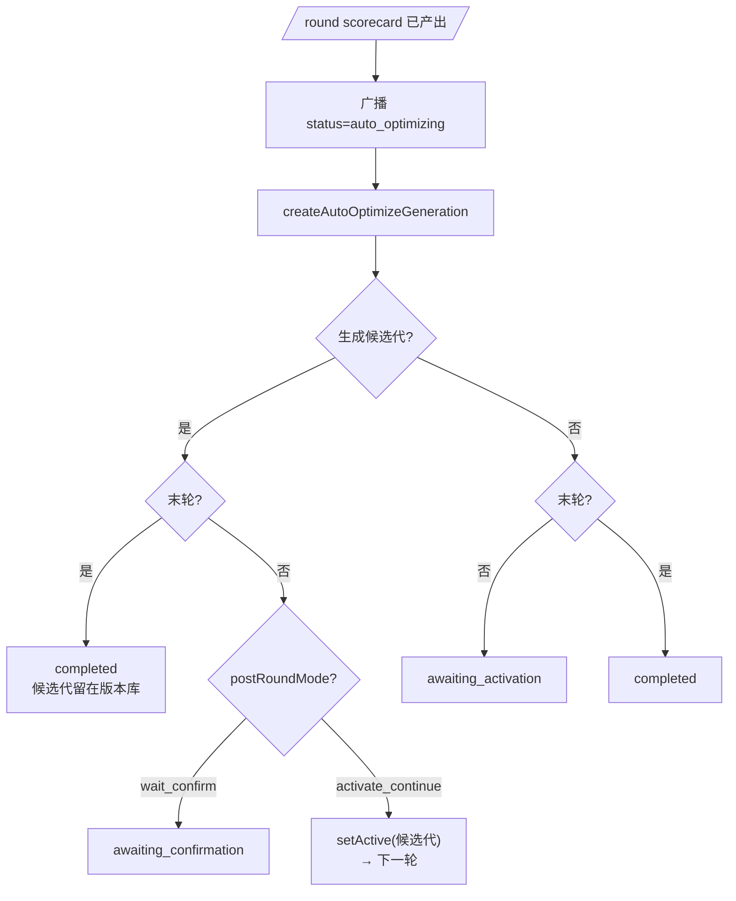

# AI 提示词自动对局评估自迭代 · 自动优化器

| 字段 | 内容 |
| --- | --- |
| 文档类型 | Design |
| 文档状态 | Active |
| 适用范围 | 自动对局评估自迭代中的自动优化器、轮后状态流转与详情重建 |
| 目标读者 | 后端开发、评审者 |
| 责任人 | AI / Evaluation 维护者 |
| 最近核对日期 | 2026-06-16 |
| 关联代码 | `apps/api/src/iteration/`、`apps/api/src/ai/`、`apps/web/app/iteration/` |
| 关联文档 | [AI-Prompt-Eval.md](./AI-Prompt-Eval.md)、[AI-Prompt-Eval-Flow.md](./AI-Prompt-Eval-Flow.md)、[AI-Prompt-Eval-Details.md](./AI-Prompt-Eval-Details.md)、[Replay-Analysis.md](./Replay-Analysis.md) |

这篇是自动优化器的单独维护点。以后只要修改自动优化器的实现逻辑、状态流转、请求重建或重试策略，优先改这里，不需要同步改 Flow / Details 的实现细节。

## 1. 作用范围

自动优化器发生在每轮 `scorecard` 产出之后，由 `IterationService.createAutoOptimizeGeneration` 负责，把本轮 scorecard、逐局摘要和当前代 assets 交给优化模型，生成新的候选代。

它只处理这几件事:

- 读取本轮实际运行的 AI 代。
- 锁定本轮使用的评估尺子代。
- 组装优化器 system / user prompt。
- 调模型、校验返回、派生候选代。
- 写入 `IterationRound.autoOptimize` 的留痕字段。
- 驱动轮后状态流转和前端展示。

## 2. 状态流转

自动优化相关的轮后状态只看三种 mode:

- `manual`: 不自动生成候选代，轮间人工操作。
- `auto_optimize_wait_confirm`: 生成候选代后等待人工确认再继续。
- `auto_optimize_activate_continue`: 生成候选代后直接激活并继续下一轮。

要点:

- 自动优化每轮都跑，包括末轮。
- 末轮生成的候选代会正常落库，但 run 仍然会 `completed`。
- `auto_optimizing` 是阻塞式大模型调用前的过渡状态，先广播再执行。
- `retryAutoOptimize()` 也是先 ack 再异步跑，避免 WebSocket 超时。
- 进程重启后，`awaiting_confirmation` / `awaiting_activation` 的 run 仍可恢复继续操作。

## 3. 优化链路

1. **取源代 assets**: `prompts.getGenerationAssets(generationId)`，也就是本轮实际跑的 AI 代。
2. **锁定评估尺子代**: `runRound()` 在进入自动优化前读取 `evalPrompts.getActiveGenerationId()`，并传入 `createAutoOptimizeGeneration(generationId, round, evalGenerationId)`。
3. **加载 system / user 模板**: system 和 user 都从同一个 `evalGenerationId` 读取 `auto-optimize/system-prompt-optimizer.txt` 与 `auto-optimize/user-prompt-optimizer-template.txt`。
4. **构造 user 消息**: 用 `renderTemplateString` 注入 `{{generationId}}`、`{{assetKeysJson}}`、`{{currentPromptsJson}}`、`{{currentPersonasJson}}`、`{{scorecardJson}}`、`{{gamesJson}}`。
5. **调用模型**: 复用 `REPLAY_ANALYSIS_*` 配置，不单独配优化模型。
6. **解析 + 校验**: 返回必须是 `{changedAssets, note}`，只允许已知 asset key，必须是完整内容，不接受 diff。
7. **结果状态**: 无有效变更记为 `skipped`；成功则 `createGeneration(...)` 生成候选代并记为 `created`；失败记为 `failed`。

## 4. 结果留存与详情重建

自动优化记录在前端详情里按这个顺序查看：

1. 生成结果
2. 本轮聚合 scorecard
3. 用户提示词
4. 系统提示词
5. 完整请求 JSON

对应数据来源:

- 生成结果来自 `IterationRound.autoOptimize.response`。
- 本轮聚合 scorecard 直接取该轮 `aggregate`。
- 用户提示词、系统提示词和完整请求 JSON 由 `GET /debug/iterations/auto-optimize-request/:runId/:roundNo` 重建。
- 重建时优先使用 `IterationRound.autoOptimize.evalGenerationId`，只有历史数据缺失时才回退当前 active 评估尺子代。

## 5. 重试与日志

- 自动优化失败后可以点「重试自动优化」。
- 重试路径会先把 run 置回 `auto_optimizing`，再异步执行真正的模型调用。
- `auto_optimizing` 只是过渡状态，不代表最终结果。
- `createAutoOptimizeGeneration` 的完整请求与完整返回只在 debug 日志里打印，默认日志只保留关键节点。

