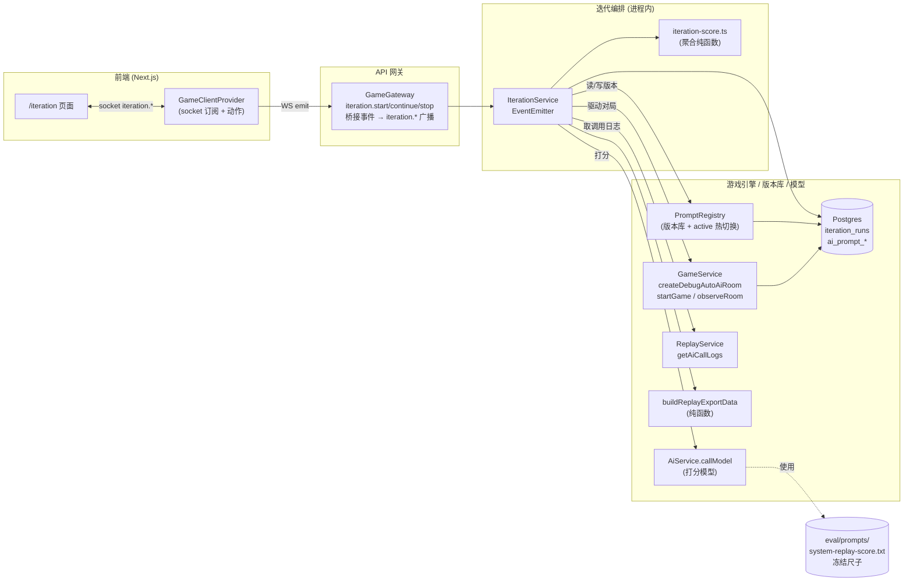
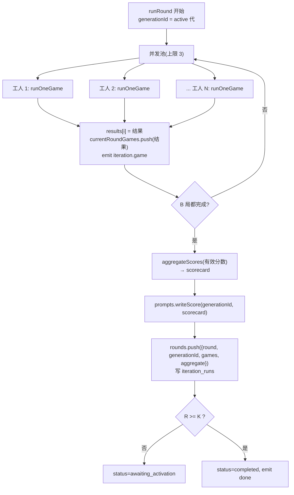
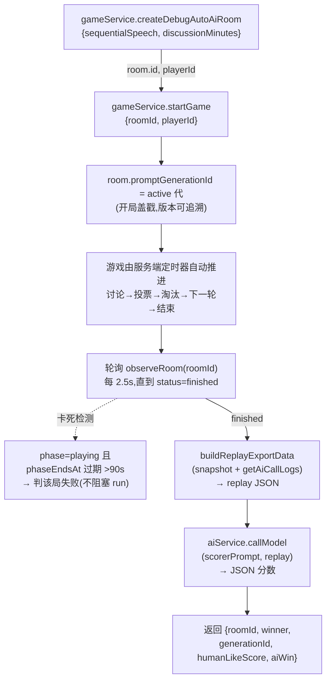
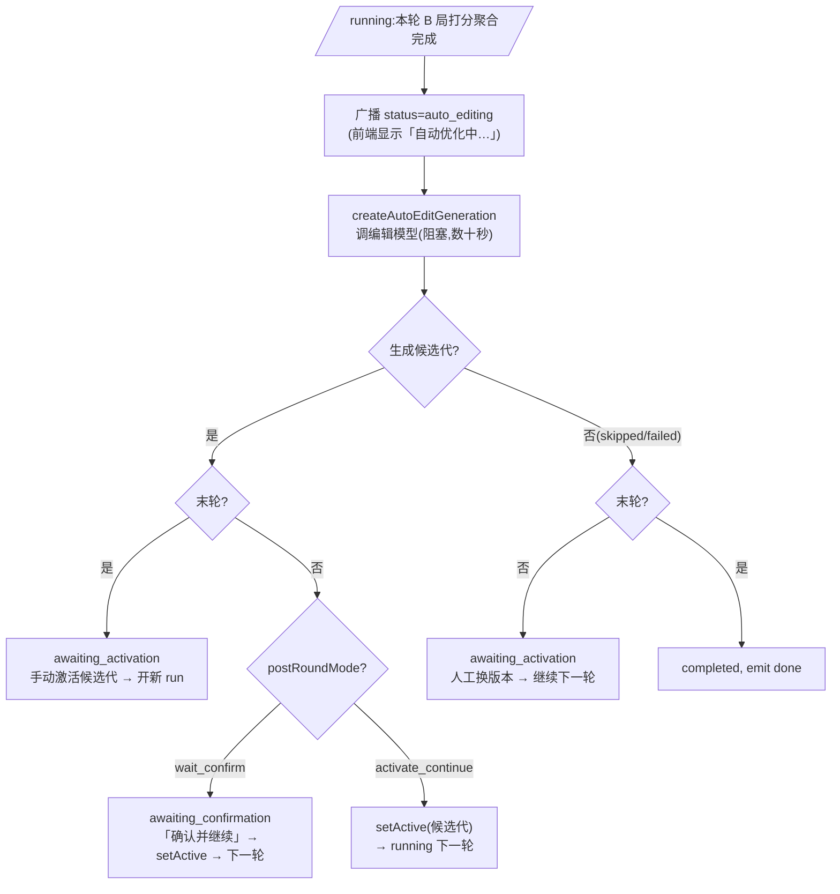
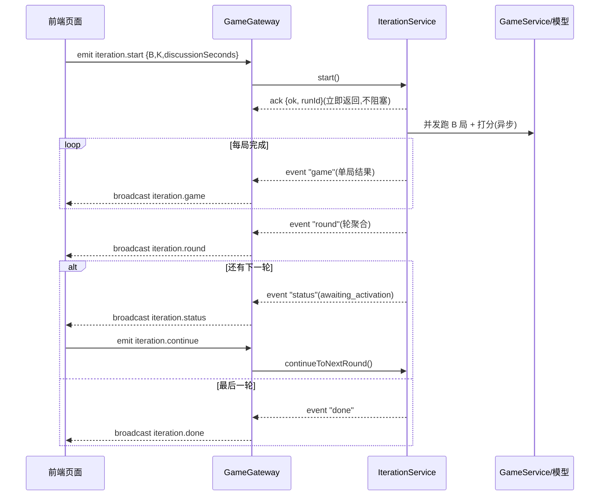
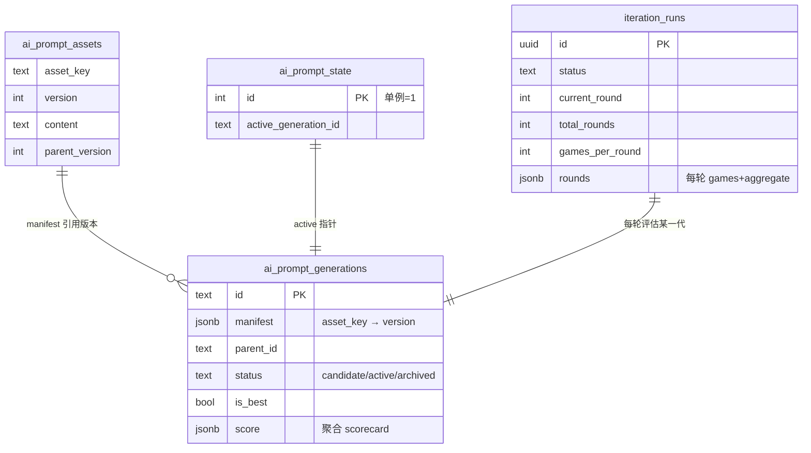

# AI 提示词自动对局评估自迭代 · 整体流程

| 字段 | 内容 |
| --- | --- |
| 文档类型 | Design |
| 文档状态 | Active |
| 适用范围 | 自动对局评估自迭代的整体流程、状态流转与数据模型 |
| 目标读者 | 后端开发、评审者 |
| 责任人 | AI / Evaluation 维护者 |
| 最近核对日期 | 2026-06-15 |
| 关联代码 | `apps/api/src/ai/`、`apps/api/src/replay/`、`apps/web/app/iteration/` |
| 关联文档 | [AI-Prompt-Eval-Details.md](./AI-Prompt-Eval-Details.md)、[AI-Human-Likeness.md](./AI-Human-Likeness.md)、[Replay-Analysis.md](./Replay-Analysis.md) |

本文聚焦整体流程与运行逻辑，配合流程图说明「自动对局评估自迭代」如何运转。设计动机与取舍见 [`AI-Prompt-Eval-Details.md`](AI-Prompt-Eval-Details.md)，拟人化迭代记录见 [`AI-Human-Likeness.md`](AI-Human-Likeness.md)。与「复盘」([`Replay-Analysis.md`](./Replay-Analysis.md)) 的区别是：复盘是单局定性分析（开放文本、不改状态，给人读）；本文是批量定量评估（结构化 JSON 分数、聚合 scorecard、驱动版本激活/回滚）。两者共用复盘导出 JSON 与 `REPLAY_ANALYSIS_*` 模型，但尺子(`eval/prompts/system-replay-score.txt`)与输出不同。

## 1. 概览

点击「开始迭代」→ 服务端**进程内**用当前提示词版本跑一批无头对局 → 用**冻结的打分尺子**逐局量化打分 → 聚合成 scorecard → 轮间由人工在页面上创建/激活新版本 → 继续下一轮,循环 K 轮。全程实时可见进度,版本可一键回滚。

---

## 2. 组件总览



关键点:
- **对局在进程内跑完**:`IterationService` 直接调 `GameService.createDebugAutoAiRoom + startGame`,纯服务端定时器推进(讨论→投票→淘汰→下一轮→结束),**不需要 socket 客户端**。
- **IterationService 不碰 socket**:它用 `EventEmitter` 发本地事件,由 `GameGateway` 桥接成 `iteration.*` 广播,保持可测试、解耦。
- **打分尺子冻结**:scorer 提示词按绝对路径加载,**不进版本库**,确保跨版本打分可比。

---

## 3. 核心概念

| 概念 | 说明 |
| --- | --- |
| **代(generation)** | 一组提示词版本的快照(6 个文本模板 + 人格库 JSON 的各一个版本号)。`ai_prompt_generations` 一行。 |
| **active 代** | 当前线上对局实际使用的代,由 `ai_prompt_state` 单例指针指定。**热切换**:改指针即生效,无需重启。 |
| **run** | 一次「开始迭代」到「完成/停止」的过程,含 K 轮。`iteration_runs` 一行。 |
| **轮(round)** | 用当前 active 代跑 B 局 → 打分 → 聚合。轮与轮之间可人工换版本,也可由「自动优化」基于本轮 scorecard 派生候选代后等待确认或自动继续(详细逻辑见 [`AI-Prompt-Eval-Details.md`](./AI-Prompt-Eval-Details.md) §4)。 |
| **自动优化(auto-edit)** | 轮聚合后调用编辑模型,基于 scorecard + 逐局摘要 + 当前代 assets 派生候选代。UI 称「自动优化」,代码标识符沿用历史名 `autoEdit` / `createAutoEditGeneration` / 状态 `auto_editing` / 轮后模式 `auto_edit_*`。 |
| **scorecard** | 一轮 B 局分数的聚合(胜率、humanLikeScore 均值±标准误、各 tell 命中率、高频问题)。 |

---

## 4. 整体迭代流程(主循环)

```mermaid
flowchart TD
  START([用户在 /iteration 设置 B/K/讨论时长<br/>点「开始迭代」]) --> ACK
  ACK["socket iteration.start"] --> INIT["IterationService.start()<br/>校验 DEBUG + 单 run 互斥<br/>建 iteration_runs 行 status=running round=1<br/>emit status"]
  INIT --> ROUND

  subgraph ROUND["runRound(round R)"]
    direction TB
    R1["读 active 代 id"] --> R2["并发跑 B 局(上限 3)<br/>逐局 emit iteration.game"]
    R2 --> R3["聚合 scorecard"]
    R3 --> R4["writeScore(active代, scorecard)<br/>持久化该轮到 iteration_runs.rounds"]
    R4 --> AE{"开启自动优化?<br/>(postRoundMode ≠ manual)"}
    AE -- 是 --> EDIT["广播 status=auto_editing<br/>自动优化器 createGeneration(candidate)<br/>(每轮含末轮)"]
    EDIT --> CAND{"生成候选代?"}
    AE -- 否(manual) --> NOCAND["无候选代"]
    CAND -- 否(跳过/失败) --> NOCAND
    CAND -- 是 --> LAST{"R >= K(末轮)?"}
  end

  NOCAND --> NC{"末轮?"}
  NC -- 否 --> WAIT["status = awaiting_activation<br/>人工:版本面板换版本"]
  NC -- 是 --> DONE["status = completed<br/>emit done"]
  LAST -- 是 --> WAITLAST["status = awaiting_activation<br/>末轮:手动激活候选代后开新 run"]
  LAST -- 否且 wait_confirm --> CONFIRM["status = awaiting_confirmation<br/>等待人工确认候选代"]
  LAST -- 否且 activate_continue --> AUTO["自动 setActive(candidate)"]

  WAIT --> CONTW["「继续下一轮」<br/>iteration.continue"]
  CONFIRM --> CONTC["「确认并继续」<br/>setActive → continue"]
  AUTO --> NEXT["continueToNextRound()<br/>round++ → runRound"]
  CONTW --> NEXT
  CONTC --> NEXT
  WAITLAST --> ENDLAST([run 停在 awaiting_activation(无下一轮)])
  DONE --> END([结束,谱系留存])

  STOP([用户点「停止」]) -.stopRequested.-> HALT["status = stopped<br/>中断未完成局"]
```

要点:
- 轮后模式有三种:`manual`(人工编辑/激活)、`auto_edit_wait_confirm`(自动优化生成候选代,人工确认后继续)、`auto_edit_activate_continue`(自动优化生成并激活,直接继续)。**默认 `auto_edit_wait_confirm`**。
- **自动优化每轮都跑(含末轮)**:末轮若生成候选代 → 落在 `awaiting_activation`(由用户在版本谱系手动激活候选代后开新 run,因无第 K+1 轮可继续);末轮未生成候选代(manual 模式,或自动优化跳过/失败)→ `completed` 并 emit `done`。
- **自动优化是阻塞式大模型调用**(数十秒):`runRound` 进入编辑调用前先持久化并广播 `status = auto_editing`,前端立即看到「自动优化中…」;`retryAutoEdit()`(自动优化失败后用户点「重试自动优化」)同样**先 ack 再异步执行**,结果通过 `iteration.status` 事件推送,避免客户端 WebSocket 5s 超时(详见 [`AI-Prompt-Eval-Details.md`](./AI-Prompt-Eval-Details.md) §4.3)。
- 不强制换版本:保持同一代继续跑,只是为该代累积更多样本、分数会更稳。
- **单进程互斥**:同时只允许一个 run(active 代是进程级单例)。

---

## 5. 单轮内部流程(B 局并发)



---

## 6. 单局流程(对局驱动 + 打分)



说明:
- **版本感知**:每局开局盖戳 `promptGenerationId`(解析优先级与回退链见 [`AI-Prompt-Eval-Details.md`](./AI-Prompt-Eval-Details.md) §1.4)。
- **卡死兜底**:服务端进程若在对局中途重启(如 `nest --watch` 重编译),内存定时器丢失会致对局卡住;单局判失败并记 `error`,不影响整轮。

---

## 7. 打分与聚合(冻结尺子)

每局 replay 由冻结尺子 `eval/prompts/system-replay-score.txt` 打分,输出严格 JSON(`aiWin` / `aiSurvivors` / `roundsPlayed` / `humanLikeScore` / `naturalnessAiVsHuman` / `voteThreatTargeting` / `tells`(8 项)/ `topIssues`);一轮 B 局的分数由 `aggregateScores` 聚合成 scorecard,回写该代的 `ai_prompt_generations.score`,谱系面板即可看到每代分数。

> 字段定义、判定要点、scorecard 计算公式属于**详细逻辑**,见 [`AI-Prompt-Eval-Details.md`](./AI-Prompt-Eval-Details.md) §2.3(尺子 JSON 与判定要点)与 §3(聚合公式)。

---

## 8. 自动优化器(轮后状态流转)

轮 scorecard 产出后,若开启自动优化(`postRoundMode ≠ manual`,**默认 `auto_edit_wait_confirm`**),`IterationService.createAutoEditGeneration` 调编辑模型派生候选代。本节讲**状态流转与时机**;编辑器提示词、占位符、`changedAssets` 校验等内部逻辑见 [`AI-Prompt-Eval-Details.md`](./AI-Prompt-Eval-Details.md) §4。



要点:
- **每轮都触发(含末轮)**:不再受「是否末轮」限制。末轮无第 K+1 轮可继续,故候选代只能由用户在版本谱系手动激活后开新 run;`auto_edit_activate_continue` 在末轮也只落到 `awaiting_activation`,不会自动继续。
- **末轮落地判定**:有候选代 → `awaiting_activation`;无候选代(`manual` 模式,或自动优化 `skipped`/`failed`)→ `completed` 并 emit `done`。
- **阻塞调用异步化**:编辑模型调用是阻塞式(数十秒),故进入前先广播 `auto_editing`;`retryAutoEdit()`(自动优化失败后点「重试自动优化」)同样**先 ack 再异步执行**,结果经 `iteration.status` 事件推送,避免客户端 WebSocket 5s 超时。
- **重启恢复**:进程重启丢失内存 `activeRunId` 后,`continueToNextRound` / `retryAutoEdit` 经 `recoverActiveRun()` 从最近一条非终态 run 恢复,「确认并继续 / 重试自动优化」仍可用。

---

## 9. 实时事件流



- 前端首屏与断线重连走 `GET /debug/iterations`(返回当前/最近 run 快照)兜底。
- 事件:`iteration.status`(全量快照,含 `running / auto_editing / awaiting_activation / awaiting_confirmation / completed / stopped / failed` 等状态)、`iteration.game`(单局)、`iteration.round`(轮聚合)、`iteration.done`。
- 自动优化结果(候选代 id / 失败原因 / 模型原始返回)随 `iteration.status` 全量快照下发,前端无需单独轮询;`retryAutoEdit` 的异步结果亦通过同一事件推送。

---

## 10. 数据模型



---

## 11. 关键配置与常量

| 常量 | 默认值 | 说明 |
| --- | --- | --- |
| `DEFAULT_ROUNDS` (K) | 4 | 一个 run 的轮数 |
| `DEFAULT_GAMES_PER_ROUND` (B) | 6 | 每轮局数 |
| `DEFAULT_DISCUSSION_SECONDS` | 60 | 每轮讨论时长(秒,默认 60s) |
| `DEFAULT_PERSONA_MODE` | `fixed_schedule` | 开始 run 时生成 B 局人格组合表,每轮复用同一赛程 |
| `GAME_CONCURRENCY` | 3 | 单轮内并发对局上限 |
| `POLL_INTERVAL_MS` | 2500 | 轮询对局完成间隔 |
| `STUCK_AFTER_MS` | 90000 | 卡死判定阈值 |

> UI 可按「分/秒」输入讨论时长,后端统一按秒存储与计时(字段 `discussionSeconds`)。

环境变量:
- `DEBUG=true`:开启 debug 自动对局与迭代入口。
- `REPLAY_ANALYSIS_BASE_URL/API_KEY/MODEL`:打分模型(OpenAI 兼容)。
- `EVAL_SCORE_PROMPT_PATH`:冻结尺子路径(默认依次尝试 `cwd/eval/prompts/...` 与 `__dirname` 回退)。

---

## 12. 使用方式

**前端 `/iteration` 页面(唯一入口)**
设置 B/K/时长 → 开始迭代 → 实时看进度 → 轮间在「版本谱系与激活」面板:左侧选版本、右侧查看/编辑提示词、「与父代对比」看差异(高亮增删行,**仅列出与父代有差异的 asset**)→ 创建新代 → 激活 → 继续下一轮;版本行支持「删除」(**存在子版本时不允许**;删除激活代会自动回退到其父代)。

**轮次选择驱动详情视图**:顶部轮次 stepper 可点击切换关注的轮次(尚未开始的轮次不可点),下方的「逐局 / scorecard / 自动优化记录」三处随之显示该轮数据。其中「自动优化记录」是独立区块(与 scorecard 分开),每条记录可点「生成详情」打开弹窗,按 **生成结果 → 本轮聚合 scorecard → 用户提示词 → 系统提示词 → 完整请求 JSON** 的顺序查看该轮自动优化发往大模型的完整输入与模型返回。

版本管理动作背后调用的是 DEBUG 网关的 HTTP 接口(均在 `apps/api/src/ai/prompt-version.controller.ts`):`GET /debug/prompts/generations`、`GET /debug/prompts/generations/:id`、`POST /debug/prompts/generation`、`POST /debug/prompts/active`、`POST /debug/prompts/best`、`POST /debug/prompts/score`、`DELETE /debug/prompts/generation/:id`(删除代,存在子代或为无父代的激活代时拒绝)。

迭代 run 的 HTTP 兜底/详情接口(在 `apps/api/src/iteration/iteration.controller.ts`):`GET /debug/iterations`(当前/最近 run 快照)、`GET /debug/iterations/estimate`(按 `rounds/gamesPerRound/discussionSeconds/postRoundMode/sequentialSpeech` 估算预计用时与「每名玩家发言次数」,供参数面板动态提示)、`GET /debug/iterations/scorer-prompt`(冻结尺子)、`GET /debug/iterations/score-request/:roomId`(重建某局打分请求)、`GET /debug/iterations/auto-edit-request/:runId/:roundNo`(重建某轮自动优化请求,供详情弹窗)。

> 入口在首页 `{debug && ...}` 门控,需 `DEBUG=true` 且 API 在运行。
