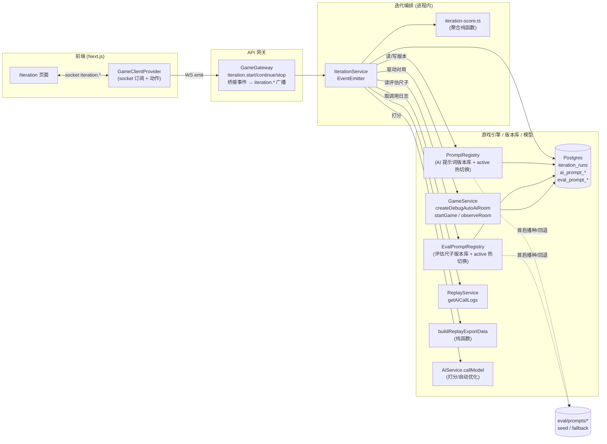
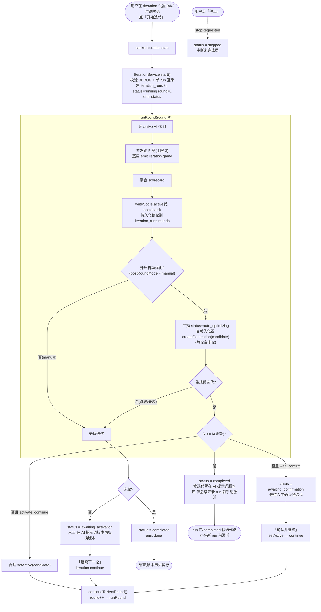
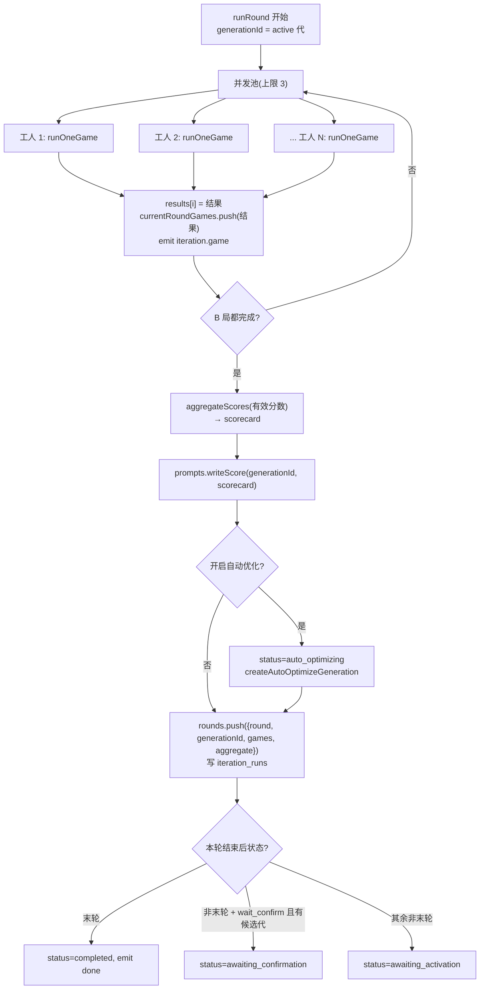
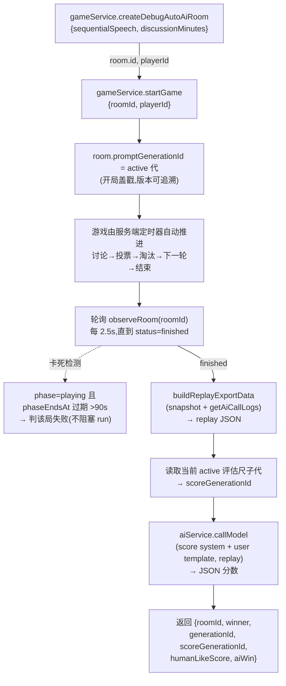
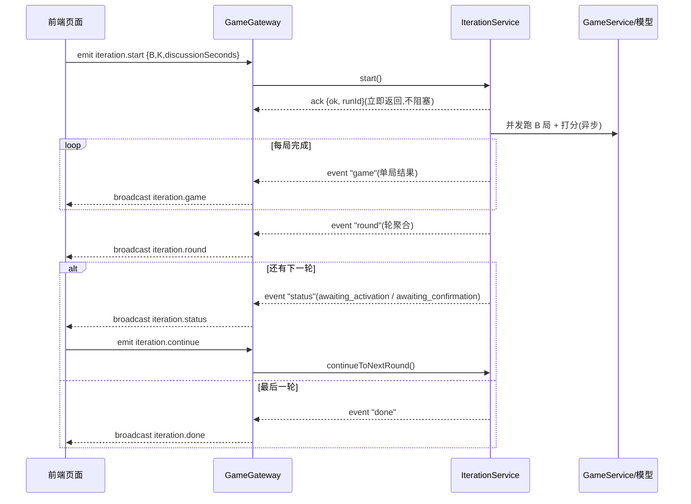
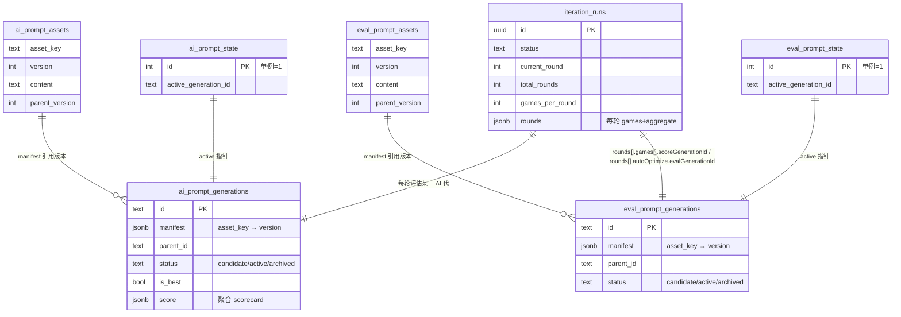

# AI 提示词自动对局评估自迭代 · 整体流程

| 字段 | 内容 |
| --- | --- |
| 文档类型 | Design |
| 文档状态 | Active |
| 适用范围 | 自动对局评估自迭代的整体流程、状态流转与数据模型 |
| 目标读者 | 后端开发、评审者 |
| 责任人 | AI / Evaluation 维护者 |
| 最近核对日期 | 2026-06-16 |
| 关联代码 | `apps/api/src/ai/`、`apps/api/src/replay/`、`apps/web/app/iteration/` |
| 关联文档 | [AI-Prompt-Eval.md](./AI-Prompt-Eval.md)、[AI-Prompt-Eval-Auto-Optimize.md](./AI-Prompt-Eval-Auto-Optimize.md)、[AI-Prompt-Eval-Details.md](./AI-Prompt-Eval-Details.md)、[AI-Human-Likeness.md](./AI-Human-Likeness.md)、[Replay-Analysis.md](./Replay-Analysis.md) |

本文只讲整体流程与运行逻辑。入口与分工见 [`AI-Prompt-Eval.md`](AI-Prompt-Eval.md); 自动优化器的内部链路、重试与详情重建见 [`AI-Prompt-Eval-Auto-Optimize.md`](AI-Prompt-Eval-Auto-Optimize.md); 设计动机与取舍见 [`AI-Prompt-Eval-Details.md`](AI-Prompt-Eval-Details.md),拟人化迭代记录见 [`AI-Human-Likeness.md`](AI-Human-Likeness.md)。与「复盘」([`Replay-Analysis.md`](./Replay-Analysis.md)) 的区别是：复盘是单局定性分析（开放文本、不改状态，给人读）；本文是批量定量评估（结构化 JSON 分数、聚合 scorecard、驱动版本激活/回滚）。两者共用复盘导出 JSON 与 `REPLAY_ANALYSIS_*` 模型，但**单局打分**与评估尺子提示词走独立版本库；`ReplayService` 的单局复盘分析提示词仍保持文件来源。

## 1. 概览

点击「开始迭代」→ 服务端**进程内**用当前激活的 **AI 提示词代** 跑一批无头对局 → 每局结束时再取当前激活的 **评估尺子代** 做量化打分 → 聚合成 scorecard → 轮间由人工在页面上**手动优化**多个提示词并一次保存成新版本,或由自动优化器派生候选代 → 继续下一轮,循环 K 轮。两套版本库独立切换,全程实时可见进度,版本可一键回滚。

---

## 2. 组件总览

关键点:
- **对局在进程内跑完**:`IterationService` 直接调 `GameService.createDebugAutoAiRoom + startGame`,纯服务端定时器推进(讨论→投票→淘汰→下一轮→结束),**不需要 socket 客户端**。
- **IterationService 不碰 socket**:它用 `EventEmitter` 发本地事件,由 `GameGateway` 桥接成 `iteration.*` 广播,保持可测试、解耦。
- **两套版本库并行**:AI 行为提示词与评估尺子分库管理;切 AI 代不会顺带改打分口径,切评估尺子也不会改 AI 行为。
- **评估尺子当前覆盖范围**:版本库只覆盖 `replay-score/*` 与 `auto-optimize/*`;`system-replay-analysis.txt` / `user-replay-analysis-template.txt` 仍由 `ReplayService` 直接读文件。
- **`eval/prompts/*` 现在是 seed / fallback**:首启播种 `eval-gen-0001`、DB 缺数据时回退读取文件;正常运行时打分和自动优化都优先读 `eval_prompt_*` 里的 active generation。

---

## 3. 核心概念

| 概念 | 说明 |
| --- | --- |
| **代(generation)** | 一组提示词版本的快照(6 个文本模板 + 人格库 JSON 的各一个版本号)。`ai_prompt_generations` 一行。 |
| **active 代** | 当前线上对局实际使用的代,由 `ai_prompt_state` 单例指针指定。**热切换**:改指针即生效,无需重启。 |
| **评估尺子代(eval generation)** | 一组评估提示词版本的快照,当前只含 `replay-score/*` 与 `auto-optimize/*` 四个 asset。由 `eval_prompt_state` 单例指针指定 active。 |
| **run** | 一次「开始迭代」到「完成/停止」的过程,含 K 轮。`iteration_runs` 一行。 |
| **轮(round)** | 用当前 active 代跑 B 局 → 打分 → 聚合。轮与轮之间可人工手动优化/换版本,也可由「自动优化」基于本轮 scorecard 派生候选代后等待确认或自动继续(实现细节见 [`AI-Prompt-Eval-Auto-Optimize.md`](./AI-Prompt-Eval-Auto-Optimize.md))。 |
| **自动优化(auto-optimize)** | 轮聚合后调用优化模型,基于 scorecard + 逐局摘要 + 当前代 assets 派生候选代。实现细节见 [`AI-Prompt-Eval-Auto-Optimize.md`](./AI-Prompt-Eval-Auto-Optimize.md)。 |
| **scorecard** | 一轮 B 局分数的聚合(胜率、humanLikeScore 均值±标准误、各 tell 命中率、高频问题)。 |
| **`scoreGenerationId` / `autoOptimize.evalGenerationId`** | 运行时写入 `iteration_runs.rounds` 的历史指针,分别记录“某局打分时用的评估尺子代”和“某轮自动优化时用的评估尺子代”,用于事后如实重建请求。 |

---

## 4. 整体迭代流程(主循环)

要点:
- 轮后模式有三种:`manual`(手动优化/激活)、`auto_optimize_wait_confirm`(自动优化生成候选代,人工确认后继续)、`auto_optimize_activate_continue`(自动优化生成并激活,直接继续)。**默认 `auto_optimize_wait_confirm`**。
- **自动优化每轮都跑(含末轮)**:末轮若生成候选代,候选代照常落库,但 run 仍直接 `completed`;是否采纳该候选代,由用户在后续新 run 之前到「AI 提示词版本」面板手动激活。
- **自动优化是阻塞式大模型调用**(数十秒):`runRound` 进入优化调用前先持久化并广播 `status = auto_optimizing`,前端立即看到「自动优化中…」;`retryAutoOptimize()` 的异步执行和详情重建见 [`AI-Prompt-Eval-Auto-Optimize.md`](./AI-Prompt-Eval-Auto-Optimize.md)。
- 不强制换版本:保持同一代继续跑,只是为该代累积更多样本、分数会更稳。
- **单进程互斥**:同时只允许一个 run(active 代是进程级单例)。

---

## 5. 单轮内部流程(B 局并发)

---

## 6. 单局流程(对局驱动 + 打分)

说明:
- **双版本感知**:每局开局盖戳 `promptGenerationId`;进入打分前再记录 `scoreGenerationId`。前者回答“这局 AI 当时跑的是哪一代”,后者回答“这局后来是按哪套评估尺子打的分”。
- **卡死兜底**:服务端进程若在对局中途重启(如 `nest --watch` 重编译),内存定时器丢失会致对局卡住;单局判失败并记 `error`,不影响整轮。

---

## 7. 打分与聚合(版本化评估尺子)

每局 replay 都会先锁定一个 `scoreGenerationId`,再从该评估尺子代读取 `replay-score/system-replay-score.txt` 与 `replay-score/user-replay-score-template.txt` 打分,输出严格 JSON(`aiWin` / `aiSurvivors` / `roundsPlayed` / `humanLikeScore` / `naturalnessAiVsHuman` / `voteThreatTargeting` / `tells`(8 项)/ `topIssues`)；一轮 B 局的分数由 `aggregateScores` 聚合成 scorecard,回写该 AI 代的 `ai_prompt_generations.score`,「AI 提示词版本」面板即可看到每代分数。

这意味着:

- **运行时默认口径**取决于当前 active 评估尺子代。
- **历史详情回放**优先取 `scoreGenerationId`,因此切换评估尺子后不会污染旧局的 score-request。
- `eval/prompts/system-replay-score.txt` 只是 seed / fallback,不是唯一运行时来源。

> 字段定义、判定要点、scorecard 计算公式属于**详细逻辑**,见 [`AI-Prompt-Eval-Details.md`](./AI-Prompt-Eval-Details.md) §2.3(尺子 JSON 与判定要点)与 §3(聚合公式)。

---

## 8. 自动优化器

自动优化器的内部链路、重试和详情重建已独立到 [`AI-Prompt-Eval-Auto-Optimize.md`](./AI-Prompt-Eval-Auto-Optimize.md)。本文只保留主循环里的位置感:

- 轮聚合完成后，如果开启自动优化，`runRound` 会先广播 `status = auto_optimizing`。
- 后续是否进入 `awaiting_confirmation`、`awaiting_activation`、`completed`，由自动优化器文档定义的模式和结果决定。
- 如果只改自动优化器实现逻辑，优先改独立文档，不要在这里同步展开细节。

---

## 9. 实时事件流

- 前端首屏与断线重连走 `GET /debug/iterations`(返回当前/最近 run 快照)兜底。
- 事件:`iteration.status`(全量快照,含 `running / auto_optimizing / awaiting_activation / awaiting_confirmation / completed / stopped / failed` 等状态)、`iteration.game`(单局)、`iteration.round`(轮聚合)、`iteration.done`。
- 自动优化结果(候选代 id / 失败原因 / 模型原始返回)随 `iteration.status` 全量快照下发,前端无需单独轮询;`retryAutoOptimize` 的异步结果亦通过同一事件推送。

---

## 10. 数据模型

---

## 11. 关键配置与常量

| 常量 | 默认值 | 说明 |
| --- | --- | --- |
| `DEFAULT_ROUNDS` (K) | 4 | 一个 run 的轮数 |
| `DEFAULT_GAMES_PER_ROUND` (B) | 6 | 每轮局数 |
| `DEFAULT_DISCUSSION_SECONDS` | 60 | 每轮讨论时长(秒,默认 60s) |
| `DEFAULT_PERSONA_MODE` | `fixed_schedule` | 开始 run 时生成 B 局人格组合表,每轮复用同一赛程 |
| `GAME_CONCURRENCY` | 3 | 单轮内并发对局上限 |
| `POLL_INTERVAL_MS` | 2500 | 轮询对局完成间隔 |
| `STUCK_AFTER_MS` | 90000 | 卡死判定阈值 |

> UI 可按「分/秒」输入讨论时长,后端统一按秒存储与计时(字段 `discussionSeconds`)。

环境变量:
- `DEBUG=true`:开启 debug 自动对局与迭代入口。
- `REPLAY_ANALYSIS_BASE_URL/API_KEY/MODEL`:打分模型(OpenAI 兼容)。
- `EVAL_PROMPTS_DIR`:评估尺子 seed 文件目录;首启播种 `eval-gen-0001` 与 DB 缺数据回退时使用。
- `EVAL_SCORE_PROMPT_PATH`:仅覆盖 seed / fallback 中的 `system-replay-score.txt`;不会绕过 `eval_prompt_*` 版本库直接接管运行时 active generation。

---

## 12. 使用方式

**前端 `/iteration` 页面(唯一入口)**
设置 B/K/时长 → 开始迭代 → 实时看进度 → 轮间在两个版本面板里操作:

- **「AI 提示词版本」**:左侧选 AI generation,右侧可在 7 个 asset 间切换调整。允许**同时修改多个提示词/人格正文**,下拉里对已改 asset 标 `*`,状态栏显示“已修改 N 项”;点击保存时会把所有脏修改一次性提交给 `POST /debug/prompts/generation`,派生一个新的 AI 子代。切换 asset 不丢草稿,切换 generation 会在有未保存修改时确认。
- **「评估尺子版本」**:交互与上面一致,但调整对象是 `replay-score/*` 与 `auto-optimize/*` 四个 asset。保存时调用 `POST /debug/eval-prompts/generation`,派生一个新的 `eval-gen-*`。切 active 后,后续新局打分与后续自动优化立即改用新的评估尺子。

两块面板都支持「与父代对比」查看差异(高亮增删行,**仅列出与父代有差异的 asset**)；版本行支持「删除」(**存在子版本时不允许**;删除激活代会自动回退到其父代)。

**轮次选择驱动详情视图**:顶部轮次 stepper 可点击切换关注的轮次(尚未开始的轮次不可点),下方的「逐局 / scorecard / 自动优化记录」三处随之显示该轮数据。其中「自动优化记录」是独立区块(与 scorecard 分开),每条记录可点「生成详情」打开弹窗,按 **生成结果 → 本轮聚合 scorecard → 用户提示词 → 系统提示词 → 完整请求 JSON** 的顺序查看该轮自动优化发往大模型的完整输入与模型返回。

版本管理动作背后调用的是 DEBUG 网关 HTTP 接口:

- AI 提示词版本库(`apps/api/src/ai/prompt-version.controller.ts`):`GET /debug/prompts/generations`、`GET /debug/prompts/generations/:id`、`POST /debug/prompts/generation`、`POST /debug/prompts/active`、`POST /debug/prompts/best`、`POST /debug/prompts/score`、`DELETE /debug/prompts/generation/:id`。
- 评估尺子版本库(`apps/api/src/ai/eval-prompt-version.controller.ts`):`GET /debug/eval-prompts/generations`、`GET /debug/eval-prompts/generations/:id`、`POST /debug/eval-prompts/generation`、`POST /debug/eval-prompts/active`、`DELETE /debug/eval-prompts/generation/:id`。

迭代 run 的 HTTP 兜底/详情接口(在 `apps/api/src/iteration/iteration.controller.ts`):`GET /debug/iterations`(当前/最近 run 快照)、`GET /debug/iterations/estimate`(按 `rounds/gamesPerRound/discussionSeconds/postRoundMode/sequentialSpeech` 估算预计用时与「每名玩家发言次数」,供参数面板动态提示)、`GET /debug/iterations/scorer-prompt`(当前 active 评估尺子代的打分 system prompt)、`GET /debug/iterations/score-request/:roomId`(按该局记录的 `scoreGenerationId` 重建打分请求)、`GET /debug/iterations/auto-optimize-request/:runId/:roundNo`(按该轮记录的 `autoOptimize.evalGenerationId` 重建自动优化请求,供详情弹窗)。

> 入口在首页 `{debug && ...}` 门控,需 `DEBUG=true` 且 API 在运行。
