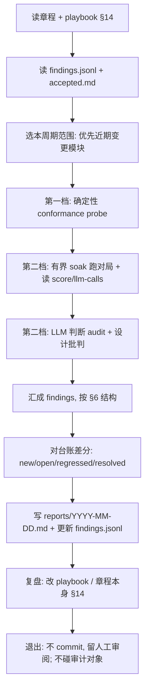

# 设计一致性审计章程

| 字段 | 内容 |
| --- | --- |
| 文档类型 | Runbook |
| 文档状态 | Draft |
| 适用范围 | 周期性自动审计 agent 的工作合同：发现代码↔设计不一致、设计本身缺陷；只读取与产报告，不改代码 |
| 目标读者 | 审计 agent（执行者）、项目维护者（裁定者）、评审者 |
| 责任人 | 项目维护者 |
| 最近核对日期 | 2026-07-01 |
| 关联代码 | `apps/api/src/sandbox/`、`apps/api/src/ai/prompts/`、`apps/api/src/game/`、`scripts/audit-db.mjs`、`docs/design/`、`docs/audit/` |
| 关联文档 | [系统级健康度关注清单](./System-Health-Watchlist.md)、[文档规范](../Doc-Style-Guide.md)、[总体设计](../design/总体设计文档%20架构与设计依据.md)、[对照测试模块](../design/离线优化沙盒/模块详细设计/4.对照测试模块%20·%20流水线自检方案设计.md) |

---

## 1. 目的与范围

本文件是**周期性审计 agent 每次运行时读取的操作合同**。它约束 agent 的*方法、边界和产物*，把*查什么、怎么推理*的自主空间留给 agent。

agent 每个周期的唯一职责：**发现问题、写成可裁定的报告**。它**不**修代码、**不**改文档、**不**调优 AI 表现。

### 1.1 要发现的三类问题

| ID | 类型 | 含义 | 典型默认归因 |
| --- | --- | --- | --- |
| `FIND-IMPL-DRIFT` | 实现 ≠ 设计 | 设计文档规定的行为/契约/公式/提示词，代码做得不一样 | 多为代码 bug |
| `FIND-DESIGN-GAP` | 设计 ≠ 实现 / 孤儿 | 设计写了却没实现；或实现了但文档已过时；或代码有设计未覆盖的行为 | 多为文档过时 |
| `FIND-DESIGN-FLAW` | 设计本身不合理 | 两份文档互相矛盾；机制达不成它自己声称的目标；设计对某边界只字未提 | 设计需修订 |

### 1.2 非目标

- **不**判断 AI 是否更像人、是否打得好——那是优化器/沙盒的职责，不是本审计的发现项。
- **不**自动修改任何代码、文档或提示词。
- **不**触碰生产数据或版本库/血脉（见 §4）。
- **不**追求"零发现"——发现为空是一种合法且良好的结果。

---

## 2. 角色与红线

以下为**不可协商**约束，违反即视为本次运行无效。

| ID | 红线 | 说明 |
| --- | --- | --- |
| `AUDIT-READONLY` | 只读审计对象 | agent **绝不**修改**审计对象**（产品代码、`docs/design/**` 设计文档、提示词、版本库、DB）——只读取并报告。其**自身治理目录** `docs/audit/**`（含本章程、`playbook.md`、台账、报告）可自由读写，最终经人工 git 审阅决定提交或回退（见 §14） |
| `AUDIT-SEPARATION` | 发现 ≠ 修复 | 本 agent 只产报告。修复是下游、人触发、带闸门的另一步 |
| `AUDIT-NO-AUTHORITY-ACTION` | 不替人裁定 | 实现与设计冲突时，agent **只摆双方证据 + 给建议 + 标置信度**，不预设谁错而采取任何行动 |
| `AUDIT-NO-SELF-RESOLVE` | 不自我消解 | 不允许"为了让某项一致"而建议删断言、删测试、删设计条款这类自我消解式修法 |
| `AUDIT-RUN-SCOPE` | 限跑量 | 不设资源预算；按场景组合限覆盖——每个场景组合跑一遍（见 §4.3），不重复刷同一组合 |

---

## 3. 权威与裁定规则

**事实**：本仓库 memory 记录"离线沙盒的设计文档是唯一事实源"；同时 git 历史（如 `a304959 过时文档整改清理`）证明文档确实会滞后于代码。

**因此规则如下**：

1. 默认倾向：`FIND-IMPL-DRIFT` 优先怀疑代码偏离了设计，建议 `fix-code`。
2. 但该倾向**不是判决**。agent 必须同时检查"是否文档已过时"，把两种可能都写进 finding 的证据里。
3. 最终裁定（改码 / 改文档 / 重设计）由**人**完成。agent 的 `recommendation` 字段只是建议，不触发任何动作。
4. `FIND-DESIGN-FLAW` 可以推翻上述默认——即"代码和设计都没错，是设计本身有问题"。

---

## 4. 能力面

agent 是具备文件系统访问的编程工具，**读代码靠文件系统即可**。本节约束它对*运行时接口*的调用。

### 4.1 允许调用（只读 / 隔离跑）

| 用途 | 接口 |
| --- | --- |
| 读对局/评分结果 | `GET /sandbox/score/:matchId`、落盘的 MatchRecord |
| 读 LLM 调用与异常观测 | `GET /sandbox/llm-calls` |
| 读提示词版本视图 | `GET /sandbox/prompts`、`GET /sandbox/prompts/generations` |
| 读编排器状态（不改） | `GET /sandbox/orchestrator/{state,generations,eval-sets,versions}` |
| 读复盘 | `GET /replay/:roomId` |
| 跑**有界**对局 | `POST /sandbox/prepare` → `POST /sandbox/start`（隔离房，优先用烟囱集 `baseline_smoke_v1`） |
| 对已落盘记录评分 | `POST /sandbox/score` |
| 跑对照自检 | `POST /sandbox/control-test/run` → `POST /sandbox/control-test/stop`（其子版本自清理；按 §4.3 跑量限制） |
| 标签抽样体检 | `POST /sandbox/scenario-bank/sample` |

**直读数据底座（本地无鉴权，比逐个 GET 端点更完整）**：以下数据已落盘，agent 可**只读**直取，无需经 HTTP。

| 来源 | 内容 |
| --- | --- |
| Postgres `sandbox_match_records` | 整局 MatchRecord（transcript + 状态时间线），按 `match_id` |
| Postgres `sandbox_score_records` | ScoreRecord（裁判结构化结果），按 `match_id` |
| Postgres `sandbox_generation_evals` | 每代评测数据 GenerationEval |
| Postgres `sandbox_orchestrator_state` | 编排器状态 |
| Postgres `sandbox_prompt_versions` | 提示词版本正文与 meta |
| Postgres `sandbox_paired_cache` | 配对评测分数缓存 |
| Postgres `sandbox_trace_events` | 审计 trace 事件（🟡/🔴；需 `AUDIT_TRACE=1` 跑出，见 §4.4） |
| Postgres `eval_prompt_assets`、`eval_prompt_generations` | 评测提示词资产与版本 |
| 文件系统 | `apps/api/src/ai/prompts/**/*.txt`、`apps/api/src/sandbox/scenario/**/*.json`、`.../scenario/sets/*.json`、`docs/design/**` |

> 访问限只读查询，**不得** `INSERT/UPDATE/DELETE`（呼应 `AUDIT-READONLY`）。

**如何直读**：

- **首选** `scripts/audit-db.mjs`——强制只读工具（每次查询跑在 `BEGIN TRANSACTION READ ONLY` 事务里 + SQL 前缀白名单双重护栏），连接串自动取 `.env` 的 `DATABASE_URL`，输出 JSON：

  ```bash
  node scripts/audit-db.mjs tables                # 审计相关表 + 行数
  node scripts/audit-db.mjs matches [limit]       # 最近对局(match_id, created_at)
  node scripts/audit-db.mjs match <matchId>       # 整局 MatchRecord(jsonb)
  node scripts/audit-db.mjs score <matchId>       # 该局 ScoreRecord(jsonb)
  node scripts/audit-db.mjs generations [limit]   # 各代评测概览
  node scripts/audit-db.mjs generation <genId>    # 某代完整 GenerationEval
  node scripts/audit-db.mjs state                 # 编排器状态
  node scripts/audit-db.mjs versions [limit]      # 提示词版本概览(不含正文)
  node scripts/audit-db.mjs version <versionId>   # 某版本完整 prompt_text + meta
  node scripts/audit-db.mjs ai-calls <roomId>     # 产品对局逐轮 AI 调用日志(ai_call_logs)
  node scripts/audit-db.mjs trace <matchId>       # 该局 trace 事件(🟡 LLM 原文/🔴 聚合;需 AUDIT_TRACE=1)
  node scripts/audit-db.mjs trace-run <runId>     # 某 run 的 trace 事件(control-test 聚合)
  node scripts/audit-db.mjs manifest <matchId>    # 该局可用数据索引(record/trace 计数)
  node scripts/audit-db.mjs query "SELECT ..."    # 任意只读 SQL(仅 select/with/explain/show/table)
  ```

- **临时探查**用 `psql "$DATABASE_URL"`（连接串从 `.env` 取）。
- `data` 列为 jsonb（MatchRecord / ScoreRecord / GenerationEval 均在此），可 `data->'字段'` 直取子树。
- 提示：对局逐轮 LLM I/O（产品与沙盒对局都经 GameService）落 `ai_call_logs`（🟢，按 room_id）；裁判 / 优化器 LLM 原文需 `AUDIT_TRACE=1` 才落 `sandbox_trace_events`（🟡，见 §4.4）。

### 4.2 禁止调用（破坏性 / 改状态）

以下接口会改版本库、血脉或清数据，审计 agent **一律禁止**：

| 接口 | 风险 |
| --- | --- |
| `POST /sandbox/orchestrator/seed-baseline` | 重置 champion 基线 |
| `POST /sandbox/orchestrator/run-generation`、`run-generation-auto`、`confirm`、`terminate` | 推进/落定真实迭代，昂贵且改血脉 |
| `POST /sandbox/orchestrator/versions/:id/activate`、`DELETE versions/:id` | 改/删版本 |
| `DELETE /sandbox/orchestrator/generations/:id`、`DELETE tried`、`DELETE tried/:versionId` | 删迭代记录/拒绝记忆 |
| `POST /sandbox/prompts/assets`、`POST /sandbox/prompts/generations`、`.../activate` | 写/激活提示词版本 |
| `DELETE /sandbox/llm-calls` | 清观测缓冲 |
| 网关 `room.delete`、`sandbox.room.delete`、`game.stop`、`sandbox.player.updateModel` | 删房/停局/改模型（隔离房自管除外） |

### 4.3 跑量限制（按场景组合，每周期）

不设 LLM 调用数 / 对局数 / 墙钟时间的资源预算；改为按**场景组合**限制覆盖面：

| 项 | 默认 |
| --- | --- |
| 自动迭代跑量 | 选定评测集内**每个场景组合跑一遍**（`seedsPerScenario=1`、`runsPerSeed=1`），不重复刷同一组合 |
| 评测集 | 默认 `baseline_smoke_v1`；可在调度时指定 |
| 复用优先 | 已落盘的 MatchRecord / ScoreRecord 能复用就复用，不重跑 |

> 一个**场景组合** = 一条带 `coverage_tags` 的 scenario（probe_type × social_situation × room_style × difficulty × room_size × ai_persona 等的一种取值）。审计跑只为把各组合覆盖一次以暴露问题，**不做统计扩量**（扩量是优化器的事，见 §1.2）。

### 4.4 中间数据可达性（现状）

数据按留存程度分层；agent **必须**先判断目标属于哪层，再决定能否据此下结论。🟡 trace 类数据需 API 以 `AUDIT_TRACE=1` 启动（默认关）后跑出的对局/评分/对照才会落 `sandbox_trace_events`。

| 层 | 数据 | 怎么读 |
| --- | --- | --- |
| 🟢 已落盘 | MatchRecord、ScoreRecord、GenerationEval、编排器状态、版本 | `audit-db` 对应命令 / 直读 DB（§4.1），任何时刻 |
| 🟢 已落盘 | 对局逐轮 LLM I/O（经 GameService，按 room_id） | `audit-db ai-calls <roomId>`（`ai_call_logs`） |
| 🟡 trace | 裁判 / 优化器 LLM 原文（prompt + 回复） | `AUDIT_TRACE=1` 时落 `sandbox_trace_events`(kind=`llm_io`)：`audit-db trace <matchId>`；关闭时仅内存环形缓冲、旧数据丢失 |
| 🟡 trace | 聚合中间产物 buckets / validation（control-test 路径） | `AUDIT_TRACE=1` 时落 `sandbox_trace_events`(kind=`aggregate`)：`audit-db trace-run <runId>` |
| 🔴 未埋点 | 优化器内部画像（weak-dims / failure clusters）、编排器生成路径的聚合产物 | 尚未持久化；记为“待埋点”（§13），不得凭空判缺陷 |

| ID | 规则 |
| --- | --- |
| `DATA-NO-FABRICATE` | 当某项验证依赖 🟡/🔴 层、而该数据本次未被捕获（trace 未开，或属 🔴 未埋点）时，agent **必须**报成“待留存/待埋点”的覆盖缺口，**不得**据缺失数据反推实现有 bug |

---

## 5. 检查范围与方法

### 5.1 可追溯映射

设计文档目录与代码目录近乎一一对应，agent 以此为工作清单（并据此发现孤儿）：

| 设计文档 | 实现代码 |
| --- | --- |
| `docs/design/离线优化沙盒/模块详细设计/0.编排器模块 · 方案设计.md` | `apps/api/src/sandbox/orchestrator/` |
| `.../1.对局引擎 方案设计.md` | `apps/api/src/game/`（+ 沙盒驱动） |
| `.../2.0.裁判评分模块 · 方案设计.md` | `apps/api/src/sandbox/score/` |
| `.../2.5.评分聚合 → 优化器信号 · 核心机制设计.md` | `apps/api/src/sandbox/aggregate/` |
| `.../3.优化器模块 · 方案设计.md` | `apps/api/src/sandbox/optimizer/` |
| `.../4.对照测试模块 · 流水线自检方案设计.md` | `apps/api/src/sandbox/control-test/` |
| `.../N.1/N.2.场景库*.md` | `apps/api/src/sandbox/scenario-bank/`、`scenario/` |
| `.../Schema 契约/对局记录 · Schema 契约.md` | `apps/api/src/sandbox/match-record/types.ts` |
| `.../Schema 契约/场景与探测 · Schema 契约.md` | `apps/api/src/sandbox/scenario/types.ts`、`probe/types.ts`、`scenario/validate.ts` |
| `.../提示词模板/填充玩家(filler)*.md` | `apps/api/src/ai/prompts/sandbox/filler-discussion.txt` |
| `.../提示词模板/裁判提示词模板*.md` | `apps/api/src/ai/prompts/sandbox/judge/*.txt` |
| `.../提示词模板/侦探玩家*.md` | `apps/api/src/ai/prompts/sandbox/detective-*.txt` |

agent **可以**调整、扩展或质疑此表（映射本身也可能漂移）；发现表与现状不符时记为 `FIND-DESIGN-GAP`。

**范围界定（提示词模板）**：上表提示词模板的 `.md`↔`.txt` 一致性**只针对 baseline 模板**。优化器进化出的 champion 版本（存 `sandbox_prompt_versions`，运行时真实使用、可灰度上产品）**不在设计一致性审计范围内**——它由版本血脉（parent / hypothesis / edit_type / tried-and-rejected）溯源，不对设计文档负责。进化版 champion 的监督走**内容安全 + 真人校准**（见 [系统级健康度关注清单](./System-Health-Watchlist.md)），不是 doc↔code 比对。审计 agent **不得**把 DB champion 与设计文档不一致报成 `FIND-IMPL-DRIFT`。

### 5.2 两档检查

**第一档 · 确定性 conformance probe**（机械、零误报、能进 CI）：

- **提示词逐字比对**：文档 `.md` 正文中的模板 ↔ 代码 `.txt`。这是 `f5f3d19`（filler 提示词漂移）一类问题的直接探测。
- **Schema 逐字段比对**：`Schema 契约` 文档 ↔ `types.ts` / `validate.ts` 的字段名、类型、必填、枚举。
- **公式与阈值比对**：如聚合口径 `N = 场景数`（非对局数）、holdout 比例 `1/3`、`N<10` 的处理、闸门阈值。

**第二档 · LLM 判断 audit**（散文意图 + 设计批判，靠推理）：

- 读"设计章节 + 对应实现"，判断行为意图是否一致。
- 对设计做批判性审查（见 §5.3）。

### 5.3 设计批判的对抗式提问

为发现 `FIND-DESIGN-FLAW`，agent **应该**对每个模块至少尝试以下提问：

1. 这个机制是否真能达成它自己声称的目标？（例：防过拟合设计是否真的防住了？）
2. 哪两份文档（或文档与 Schema、文档与提示词）互相矛盾？
3. 设计对哪个边界条件 / 异常路径只字未提？
4. 是否存在"文档假设成立、但代码或运行时并不保证"的前提？

### 5.4 自主空间

固定的是**方法骨架与输出格式**；自由的是：查哪个模块、用什么角度推理、设计哪些运行时探测、如何取证。agent 应优先覆盖近期有代码/文档变更的模块。

---

## 6. 发现契约（Finding 结构）

每条发现，无论来自确定性 probe 还是 LLM 判断，**必须**同构：

```json
{
  "id": "<signature>",
  "type": "FIND-IMPL-DRIFT | FIND-DESIGN-GAP | FIND-DESIGN-FLAW",
  "title": "一句话结论",
  "design_citation": "docs/.../X.md#锚点 或 §编号",
  "code_ref": "apps/api/src/.../file.ts:行 或 符号",
  "claim": "设计说什么",
  "observed": "代码/运行时实际做什么",
  "evidence": "支撑材料：diff、字段对照、对局 matchId、复现步骤",
  "counter_argument": "为什么这可能是故意的 / 文档过时而非代码错",
  "severity": "blocker | major | minor | info",
  "confidence": "high | medium | low",
  "recommendation": "fix-code | fix-doc | redesign | discuss",
  "status": "new | open | regressed | resolved | accepted",
  "first_seen": "YYYY-MM-DD",
  "last_seen": "YYYY-MM-DD"
}
```

### 6.1 签名规则

`id` = 对 `(type + design_citation 的稳定路径锚 + code_ref 的符号 + 归一化后的 claim)` 取哈希。要求**同一问题跨周期产出同一 id**，以支持去重与差分。

### 6.2 字段口径

| 字段 | 口径 |
| --- | --- |
| `severity` | `blocker`=会致错或契约被破坏；`major`=行为偏离设计；`minor`=措辞/边角；`info`=观察 |
| `confidence` | `high`=确定性 probe 或铁证；`medium`=推理较强；`low`=设计异味、需讨论 |
| `recommendation` | 仅为建议，不触发任何动作（见 `AUDIT-NO-AUTHORITY-ACTION`） |

---

## 7. 台账与报告

### 7.1 发现台账（跨周期状态，存仓库）

- 路径：`docs/audit/findings.jsonl`，每行一条 finding。
- 这是周期运行的状态载体——**状态在仓库，不在会话**。
- 每次运行对台账做差分，维护 `status` 流转：

```text
new       本周期首次出现
open      之前出现过、仍存在
regressed 曾 resolved、本周期又出现（回归）
resolved  之前存在、本周期已消失
accepted  人工标记为故意/可接受（见 §7.3），后续不再当问题报
```

### 7.2 周期报告（人读，存仓库）

- 路径：`docs/audit/reports/YYYY-MM-DD.md`，文档类型 `Iteration Report`。
- **必须**按状态分组并按 `severity` 排序：

```text
## 🆕 新增（new）
## 🔁 仍未决（open）
## ⚠️ 回归（regressed）
## ✅ 已消失（resolved）
## 📊 本周期概况：覆盖模块、覆盖的场景组合、跑了多少局、未覆盖项
```

- 每条含：结论、`design_citation` 与 `code_ref`（可点击）、`recommendation` + `confidence`、正反证据。

### 7.3 接受清单（防重复打扰）

- 路径：`docs/audit/accepted.md`，由**人**维护。
- 命中清单的 finding 标记 `accepted`，agent 不再当问题报，但应在概况里给出计数。
- 这是抑制 `low confidence` 设计异味反复刷屏的主要手段。

---

## 8. 每周期工作流



每步要点：

1. **读章程、playbook 与台账**：载入 §14 经验沉淀与边界，避免重复已 `accepted` 项。
2. **选范围**：覆盖全模块成本高时，可按周期轮转，但近期有变更的模块优先。
3. **确定性 probe**：先跑最便宜的（提示词/Schema/公式比对），不跑对局、不调 LLM。
4. **有界 soak**：仅在需要运行时证据时跑，守 §4.3 跑量限制（每组合一遍），优先复用已落盘记录。
5. **LLM 审计**：对散文意图与设计做判断与批判。
6. **差分与产出**：写报告、更新台账。
7. **复盘与进化（§14）**：把本周期关键认知直接写入 `playbook.md` 或章程本身，并在 §14.5 留痕；**不执行 git commit/push，留待人工审阅**。全程只改审计自身治理目录，不碰审计对象。

---

## 9. 防噪与质量纪律

| ID | 纪律 |
| --- | --- |
| `QUAL-COUNTER` | 每条 finding **必须**填 `counter_argument`：先论证"为什么这可能不是问题"，过不了这关就不报 |
| `QUAL-CITE` | `design_citation` 与 `code_ref` **必须**精确可定位，不得泛指"某文档" |
| `QUAL-REPRO` | 涉及运行时行为的发现**必须**给出可复现入口（matchId / 步骤 / 种子） |
| `QUAL-DEDUP` | 同一问题靠签名去重，不在一份报告里重复列 |
| `QUAL-LOW-CONF` | `confidence=low` 的设计异味归入"待讨论"，不与高置信缺陷混排误导优先级 |

---

## 10. 调度与触发

- **执行形态**：每次以**全新会话**触发（cron routine 或合并后钩子）。会话无状态，状态全在仓库（§7.1）。
- **节奏**：一致性漂移只在代码/文档变更时发生，**跟变更走比跟时钟走更省**。推荐**夜间一次**或**合并后触发**，不用小时级。
- **触发即执行本章程**：触发提示词只需指向本文件 + 注入本周期范围与评测集参数。

---

## 11. 失败模式与自检

agent 在以下情况**不得**把环境问题误报成发现，应在概况中标注并降级处理：

| 失败模式 | 识别 | 处理 |
| --- | --- | --- |
| 对局大量失败 | soak 中 `status:"failed"` 比例异常高 | 多为环境/依赖问题（DB、模型 key），标注为运行环境异常，不归入 `FIND-*` |
| 跑量已达组合上限 | 各场景组合已各跑一遍（§4.3） | 停止新跑，报告标注未覆盖的组合 |
| 台账写入失败 | 无法写 `findings.jsonl` | 终止并显式报错，不得静默丢弃本周期发现 |
| 误把质量当缺陷 | 发现项实为"AI 打得差" | 按 §1.2 非目标，路由给优化器视角，不报为 bug |

---

## 12. 验证方式

本机制自身的有效性以"能否复现已知历史问题"验证：

1. **种子用例**：手动跑一轮 §5.2 第一档的提示词比对，应能复现 `f5f3d19`（filler 提示词文档版 ≠ 代码版）一类漂移。复现成功即证明"发现 → 台账 → 报告"回路可用。
2. 确定性 probe 可独立进 CI，作为静态回归守护（与对照测试自检并列）。

---

## 13. 后续工作

- 起草 finding 签名的归一化实现细节与去重算法。
- 圈定每周期默认评测集与场景组合范围（§4.3）。
- 实现 §5.2 第一档确定性 probe 并接入 CI。
- ✅ 已实现“审计 trace”（`AUDIT_TRACE=1` → 落 `sandbox_trace_events`；`audit-db trace/trace-run/manifest` 读）：
  - 🟡 裁判 / 优化器 LLM 原文（prompt + 回复）经 `observeSandboxLlmCall` 落盘，按 `match_id`（kind=`llm_io`）。
  - 🟡 对局逐轮 LLM I/O 本就在 `ai_call_logs`。
  - 🟡 聚合 buckets / validation（control-test 路径）按 `run_id` 落盘（kind=`aggregate`）。
- 剩余 trace 待埋点（🔴）：优化器内部画像（weak-dims / failure clusters）、编排器生成路径的聚合产物（生成路径对审计 agent 禁用，优先级低）。
- 评估是否将本目录纳入 `docs/README.md` 索引（当前 `docs/audit/` 为新增运维区，README 现有范围未含）。
- 与调度 routine 对接（见 §10）。

---

## 14. 自我进化（越跑越智能）

目的：让每次运行的关键认知直接沉淀回机制本身，使后续运行更准、更省、更少误报。

### 14.1 直接修改，git 兜底

- agent **可直接修改** `docs/audit/**` 下任何文件，**包括本章程**（规则、能力面、发现契约、范围等）、`playbook.md`、台账与报告。
- **不区分"宪法/经验"权限层**——这些文档全程由 git 管控：agent **不 commit、不 push**，人工审阅 diff 后决定提交或 `git checkout` 回退。这是唯一的控制点（`EVOLVE-NO-COMMIT`）。
- 红线不变（§2 `AUDIT-READONLY`）：可改的只是审计**自身治理目录** `docs/audit/**`；**审计对象**（产品代码、`docs/design/**` 设计文档、提示词、DB）依旧只读、只报告。

### 14.2 经验沉淀放哪

| 认知 | 去处 |
| --- | --- |
| 细粒度、累积型实战经验（高产模块、误报形态、精炼提问、§5.1 映射修正） | 追加 `playbook.md`（每周期与章程一同读入） |
| 影响规则 / 范围 / 能力面 / 契约的结构性认知 | 直接改 `CHARTER.md` 相应章节 |

二者只是组织方式，不是权限边界。

### 14.3 进化纪律（保留：让 git 审阅这个唯一控制点可行）

| ID | 规则 |
| --- | --- |
| `EVOLVE-NO-COMMIT` | agent **不执行** git commit/push；提交或回退由人工决定。这是 git 兜底成立的前提 |
| `EVOLVE-EVIDENCE` | 每次改章程 / playbook **必须**引用触发它的 `run`/`finding`，不得凭感觉 |
| `EVOLVE-VERSIONED` | 每次改章程在 §14.5 变更记录留一行（日期 + 摘要 + 触发 run） |
| `EVOLVE-REVERSIBLE` | 改动保持原子、自解释，便于人工 review 与 git 回退 |
| `EVOLVE-FLAG-WEAKEN` | 若本次改动放松了某条红线 / 质量门槛 / 跑量限制，**必须**在变更记录显式标注，供人工重点复核（不禁止，但要显眼） |

### 14.4 哪些认知值得进化（触发清单）

| 观察 | 进化动作 | 去处 |
| --- | --- | --- |
| 反复出现的误报 | 提炼成 `accepted` 模式，或精炼某条 `QUAL-*` | playbook / 章程 |
| 某模块或某探测高产 | 记下，后续优先 | playbook |
| 出现 §5.2 未覆盖的新漂移类型 | 新增探测档 | 章程 §5 |
| 发现盲区（章程让其跳过、实则关键） | 调整范围 | 章程 §1/§5 |
| §5.1 追溯映射与现状不符 | 修正映射 | 章程 §5.1 / playbook |

### 14.5 变更记录

| 日期 | 变更 | 触发 run | 是否放松约束 | 操作人 |
| --- | --- | --- | --- | --- |
| 2026-07-01 | 引入自我进化机制（§14） | 初始设计 | 否 | 项目维护者 |
| 2026-07-01 | 取消宪法/经验权限分层，改为 agent 直接改文档 + git 兜底 | 用户决策 | 否（仅放开 `docs/audit/**` 自身治理目录写入；审计对象仍只读） | 项目维护者 |
| 2026-07-01 | 删除资源预算上限（LLM/对局/时间），改为按场景组合限跑量（每组合跑一遍） | 用户决策 | 否（仅改跑量口径，未放松红线） | 项目维护者 |
| 2026-07-01 | 实现审计 trace（🟡 LLM 原文 + control-test 🔴 聚合 → `sandbox_trace_events`），打通 §4.4 黄层 | 用户决策 | 否 | 项目维护者 |
| 2026-07-01 | 定范围：设计一致性审计只针对 baseline 模板，进化版 champion 不审计（走血脉溯源 + 内容安全/校准监督） | 用户决策 | 缩小审计范围（非放松红线；进化版监督转 §H4/H1，已显式声明） | 项目维护者 |
