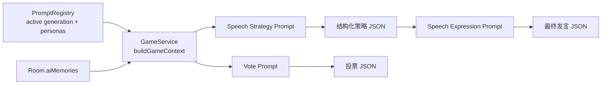

# AI 拟人化设计

| 字段 | 内容 |
| --- | --- |
| 文档类型 | Design |
| 文档状态 | Active |
| 适用范围 | 普通对局中 AI 玩家的人格、发言、投票、短期记忆与 prompt 版本化设计 |
| 目标读者 | 后端开发、评审者 |
| 责任人 | AI / Gameplay 维护者 |
| 最近核对日期 | 2026-06-19 |
| 关联代码 | `apps/api/src/ai/`、`apps/api/src/game/`、`apps/api/src/ai/prompts/ai-player/` |
| 关联文档 | [AI-Interaction-Flow.md](./AI-Interaction-Flow.md)、[AI-Scheduling.md](./AI-Scheduling.md)、[AI-Human-Likeness.md](../ai-iteration/AI-Human-Likeness.md)、[AI-Auto-Adversarial-Match.md](../ai-iteration/AI-Auto-Adversarial-Match.md)、[AI-Prompt-Eval-Details.md](../ai-iteration/AI-Prompt-Eval-Details.md)、[AI-Prompt-Cache-Optimization.md](./AI-Prompt-Cache-Optimization.md) |

## 1. 背景

普通对局里的 AI 不只是要“会回答”，而是要在公开信息约束下，表现得像一个有节奏、有口吻、有短期记忆的真人玩家。

当前项目把这件事拆成了几层：

- 策略层决定要不要说、接哪句、说什么动作。
- 表达层把策略变成真正的聊天内容。
- 短期记忆让投票和后续发言保持自洽。
- 人格库让不同 AI 在口吻和参与度上有差异。
- Prompt 版本化和缓存分层保证这些设计能稳定演进。

本文记录的是这套“拟人化设计”的当前实现，不记录具体迭代过程；迭代轨迹见 [AI 拟人化优化](../ai-iteration/AI-Human-Likeness.md)。

## 2. 目标

- 让 AI 发言像临场聊天，而不是系统复盘。
- 让不同 AI 在语气、句长、参与偏好上保持差异。
- 让发言、投票和历史行为保持自洽。
- 让 prompt 和人格可以版本化、回放可追踪、回滚可控制。

## 3. 非目标

本文不覆盖以下内容：

- 批量评估和自动优化闭环
- 单局复盘审计与回放分析
- 发言调度的时间策略细节
- 具体 prompt 文案的历史演化过程

## 4. 约束与假设

- AI 只能使用公开聊天、公开投票、自己的短期记忆和自己的 persona 信息。
- 服务端是权威状态源，模型输出不可信，必须经过严格解析与兜底。
- `GameContext` 是所有模型调用的统一输入。
- `PromptRegistry` 维护当前 active generation；运行时使用的是 active prompt 和 active persona 集合。
- 普通对局里，投票阶段必须保持盲投，不能把实时票型直接暴露给模型。
- `shortMemory` 只代表自己的公开投票历史，不代表隐藏身份或系统判断。

## 5. 方案概览



### 5.1 组件职责

| 组件 | 责任 |
| --- | --- |
| `GameService` | 构建 `GameContext`，触发发言/投票，写回房间状态与短期记忆 |
| `AiService` | 组织 prompt、调用模型、解析 JSON、记录调用日志、执行兜底 |
| `PromptRegistry` | 载入当前 active generation 的 prompt 和人格库 |
| `ai.personas.ts` | 定义默认人格库并维护当前 active 人格集合 |
| `game.types.ts` | 定义 `Room.aiMemories`、`AiShortMemory`、`RoomSnapshot` 等结构 |
| `ai.types.ts` | 定义 `GameContext`、`AiSpeechStrategy`、`AiSpeechAction`、`AiVoteAction` 等类型 |

## 6. 详细设计

### 6.1 发言策略层

发言采用两段式设计的第一段：先让模型决定“这次要不要说、怎么说、多久后说、下次多久再看”。

对应 prompt 文件：

- `apps/api/src/ai/prompts/ai-player/system-speech-strategy.txt`：系统层规则，约束发言目标、语气边界和策略输出格式。
- `apps/api/src/ai/prompts/ai-player/user-speech-strategy-template.txt`：用户层上下文模板，注入身份、历史对话、投票记忆和最近聊天。

策略层的输出结构如下：

```json
{
  "type": "speak",
  "targetResponseDelayMs": 2500,
  "nextCheckAfterMs": 10000,
  "strategy": {
    "replyTo": "3号说我机械",
    "speechAct": "防守反问",
    "publicPoint": "我只是催2号说句话，不足以说明机械",
    "tone": "有点不服，但别长篇解释",
    "maxSentences": 2,
    "constraints": ["不要同时点评多人"],
    "avoidPhrases": ["先看看大家反应", "带节奏"]
  }
}
```

策略层重点解决四个问题：

- `replyTo`：这次到底接哪一句。
- `speechAct`：这次是在追问、反问、轻互动，还是观望。
- `targetResponseDelayMs`：从看到局势到最终发言出现，目标总反应时间是多少。
- `nextCheckAfterMs`：本次决策之后多久再观察一次局势。

这里还刻意允许非分析型动作，例如闲聊、玩笑、吐槽、附和、敷衍、跑题。这个设计是为了避免 AI 永远像在做分析题。

### 6.2 表达层

发言的第二段是表达层：把结构化策略改写成最终聊天文本。

对应 prompt 文件：

- `apps/api/src/ai/prompts/ai-player/system-speech-expression.txt`：系统层表达规则，负责把策略压回临场聊天。
- `apps/api/src/ai/prompts/ai-player/user-speech-expression-template.txt`：用户层表达模板，注入策略 JSON 和同轮上下文。

表达层的输出非常简单：

```json
{ "type": "speak", "content": "最终发言内容" }
```

表达层的设计目标是“去模板化”，因此 prompt 里要求：

- 只输出最终发言，不暴露策略字段。
- 不能提到模型、策略、人格、系统要求。
- 不能把策略层的公共点原样复述成报告体。
- 默认 1-2 句，通常不超过 240 字符。
- 允许反问、省略、口头语和轻微情绪。
- 必须遵守人格库里的句长、语气词和打字习惯。

实现上，表达层和策略层可以使用不同的模型配置。`ai-models.json` 里支持 `expression` 覆盖项，因此可以给表达层更贴近口语的温度、模型或推理强度。

### 6.3 投票中的拟人化

投票也是拟人化的一部分，因为投票如果和之前的发言完全脱节，会显得像另一个系统在接管。

对应 prompt 文件：

- `apps/api/src/ai/prompts/ai-player/system-vote.txt`：系统层投票规则，约束公开理由和目标选择边界。
- `apps/api/src/ai/prompts/ai-player/user-vote-template.txt`：用户层投票模板，注入历史投票、短期记忆、可投票目标和本轮聊天。

投票 prompt 的设计原则是：

- 只能基于公开聊天、历史投票和自己的短期记忆。
- 不允许看当前轮实时票型。
- `targetPlayerId` 必须是存活玩家，且不能投自己。
- 投票理由只能写场上能公开说的话。

对普通 AI 来说，`GameContext` 虽然内部计算了 `currentVoteCounts`，但模板里会把它收束成“同时盲投，当前票数不可见”的描述，避免破坏规则。

### 6.4 短期记忆

短期记忆是当前拟人化设计里最关键的“自洽层”之一。

```ts
type AiShortMemory = {
  votes: Array<{
    roundNo: number;
    targetSeatNo: number;
    publicReason?: string;
    source: "model" | "fallback";
  }>;
};
```

实现位置：

- `Room.aiMemories` 以玩家 ID 分桶。
- `GameContext.shortMemory` 只读取当前玩家自己的记忆。
- `rememberAiVote()` 只在投票成功写入后更新。

设计约束：

- 只保留最近 4 条。
- 模型投票记录 `source: "model"`。
- 兜底投票记录 `source: "fallback"`，不伪造理由。
- 短期记忆只描述自己的公开投票和可公开解释，不代表隐藏判断。
- 如果短期记忆和聊天记录冲突，优先信聊天记录。

短期记忆会进入发言和投票 prompt，这样 AI 后续说“我上轮投了谁”“我为什么那么投”时，不会和实际历史冲突。

### 6.5 人格库

人格库的作用不是给 AI 一个固定人设，而是让不同 AI 在“句长、态度、参与意愿、回话方式”上有稳定差异。

对应代码文件：

- `apps/api/src/ai/ai.personas.ts`：默认人格库定义、active 人格集合与按 id 查询。
- `apps/api/src/ai/prompt-registry.ts`：active generation 加载人格库并注入运行时集合。
- `apps/api/src/game/game.rules.ts`：创建 AI 玩家时为角色分配人格。

当前默认人格库由 `DEFAULT_AI_PERSONAS` 提供，运行时会被 `PromptRegistry.loadActive()` 注入成 active 集合。

人格字段主要包括：

- `speechStyle`：整体说话风格
- `sentenceStyle`：句长和句式偏好
- `responseBias`：更容易在哪类场景开口
- `toneRules`：语气约束
- `avoidPhrases`：额外禁用词
- `typingHabit`：打字习惯
- `sampleLines`：口吻示例

当前库覆盖的方向大致有八类：

- 热络破冰
- 划水摸鱼
- 贫嘴玩笑
- 暴躁直球
- 表情语气
- 社恐慢热
- 认真分析
- 杠精抬杠

这些人格不是“八个独立 AI 类型”，而是给 prompt 提供差异化约束。真正的个性来自 `formatPersonaInfo()` 把这些字段转成可执行文本。

### 6.6 Prompt 版本化与缓存分层

拟人化设计依赖 prompt 版本化，不然无法稳定地比较“这次改动到底有没有变好”。

当前版本化机制包括：

- `PERSONAS_ASSET_KEY = ai-player/personas`
- `TEXT_ASSET_KEYS` 下的一组 AI 玩家 prompt
- `PromptRegistry` 维护 `activeGenerationId`
- `Room.promptGenerationId` 记录开局时的 active 代

这些设计带来的好处是：

- 可以回放时知道这一局用的是哪一代 prompt。
- 可以把人格库和文本 prompt 一起版本化。
- 可以在不改代码的情况下切换 active generation。

缓存方面，AI 玩家 prompt 使用 `<<CACHE_SPLIT>>` 做层次切分：

1. 静态指令
2. 玩家固定信息
3. 轮内稳定信息
4. 最近聊天
5. 高频变化后缀

Claude 路径会按层构造成 block 并利用 cache control；OpenAI-compatible 路径会去掉 marker 后直接发送。

## 7. 数据模型 / 接口 / 配置

### 7.1 关键类型

| 类型 | 说明 |
| --- | --- |
| `GameContext` | 模型调用的统一输入，包含公开聊天、投票历史、人格、短期记忆等 |
| `AiSpeechStrategy` | 发言策略层输出的结构化结果 |
| `AiSpeechAction` | 发言动作，`speak` 或 `skip` |
| `AiVoteAction` | 投票动作 |
| `AiPersonaContext` | 人格定义 |
| `AiShortMemory` | 自己的投票短期记忆 |
| `AiCallRecord` | 单次模型调用日志 |

### 7.2 关键配置

| 配置 / 常量 | 作用 |
| --- | --- |
| `AiModelEntry.expression` | 表达层独立模型配置 |
| `MAX_MODEL_SPEECH_CONTENT_LENGTH = 240` | 发言长度上限 |
| `DEFAULT_AI_NEXT_CHECK_MS = 10_000` | 默认下一次观察间隔 |
| `AI_VOTE_DELAY_MS = 1_500` | 投票阶段首个 AI 的延迟 |
| `AI_VOTE_STAGGER_MS = 1_200` | 多个 AI 投票错峰 |
| `AI_MODELS_PATH` | 模型配置文件位置 |

## 8. 备选方案与取舍

| 决策 ID | 决策 | 备选方案 | 取舍理由 |
| --- | --- | --- | --- |
| `DEC-DOUBLE-STAGE-SPEECH` | 发言拆为策略层 + 表达层 | 单次模型直接产出最终发言 | 双层更容易控制“是否说、什么时候说、说什么”，也更容易压掉模板感 |
| `DEC-SHORT-MEMORY-SELF-ONLY` | 只保留自己的投票短期记忆 | 存全量长记忆 | 只记自己的公开投票，能减少噪声，也更符合玩家视角 |
| `DEC-ACTIVE-PERSONA-REGISTRY` | 人格库由 active generation 管理 | 写死在代码里 | 便于版本切换、回放追踪和 prompt 迭代 |
| `DEC-BLIND-VOTE-HIDDEN` | 投票 prompt 不暴露实时票型 | 直接给出当前票数 | 保持同时盲投规则，不让模型偷看局势 |
| `DEC-CACHE-LAYERED-PROMPTS` | 用 `<<CACHE_SPLIT>>` 切分 prompt 层 | 单段 prompt | 有利于 Claude / OpenAI cache 复用和 prompt 维护 |
| `DEC-SIM-HUMAN-SEPARATION` | 模拟真人分支独立 prompt | 和普通 AI 共用同一套 prompt | 便于调试房和基线测试，不污染普通 AI 风格 |

## 9. 风险与失败模式

| 风险 | 触发条件 | 影响 | 缓解措施 |
| --- | --- | --- | --- |
| 策略层过抽象 | 输出又回到“观察、留后手、先看看”这类词 | 表达层再次模板化 | 扩充禁用词，强化具体动作约束 |
| 人格过强 | 同一个 persona 的语气特征压过内容 | 发言像在演角色，不像在聊天 | 限制人格只管口吻，不管结论 |
| 短期记忆过短 | 只保留 4 条仍不足以支持自洽 | 投票和后续发言偶尔断裂 | 先保持轻量，必要时再扩展记忆粒度 |
| 版本漂移 | active generation 在房间进行中切换 | 回放与当时行为难完全对齐 | 用 `promptGenerationId` 记录开局版本，必要时做房间级锁定 |
| JSON 解析失败 | 模型输出包裹文字或字段缺失 | 发言或投票降级 | 宽松提取 + fallback |

## 10. 验证方式

建议用以下方式验证这套设计：

1. 回放验证
   - 检查 AI 是否还在低信息场景里频繁写出模板开场。
   - 检查被质疑时是否更偏短反问而不是长篇自证。
2. 自洽验证
   - 看 `shortMemory` 是否能把前几轮投票带回后续发言。
   - 看投票理由是否和公开聊天一致。
3. 人格验证
   - 对比不同 persona 的聊天口吻是否明显分化。
4. 失败验证
   - 人工制造 JSON 非法、超时、字段缺失，确认能走 fallback。
5. 版本验证
   - 通过 `promptGenerationId` 和 `ai_call_logs` 复原当局 prompt 版本。

## 11. 已知限制

- 这套设计仍是 prompt 驱动，不是训练出来的行为策略。
- `shortMemory` 只记投票，不记更细的社会关系。
- 当前只支持“现有 persona 集合”的差异化，不能自动学习新人格。
- 普通 AI 的投票仍然主要依赖公开信息和短期记忆，没有长期信念系统。
- `promptGenerationId` 主要用于追踪，不等于运行时已经按房间级锁定版本。

## 12. 后续工作

- 如果后续仍然出现模板化，优先继续细化策略层动作，而不是无限堆示例句。
- 如果投票和发言出现新的不自洽点，再考虑扩展记忆内容，而不是先扩长 prompt。
- 如果人格之间开始变得像同一个人，再收敛 persona 数量，保留最有区分度的类型。
- 如果需要更严格的可追踪性，考虑把 prompt 版本从“active generation”进一步收紧到“room pinned generation”。
