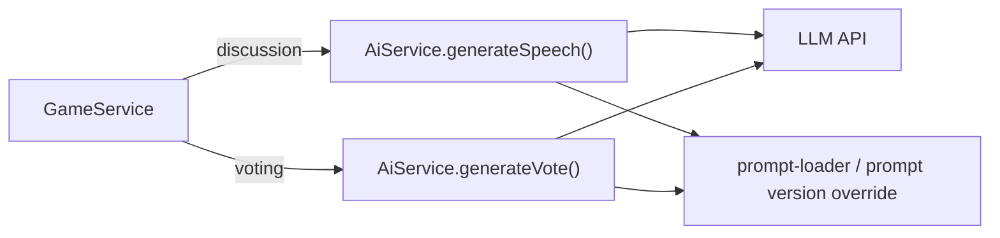

# AI 玩家交互流程

| 字段 | 内容 |
| --- | --- |
| 文档类型 | Design |
| 文档状态 | Active |
| 适用范围 | 普通对局中的 AI 玩家交互流程，以及离线沙盒复用点 |
| 目标读者 | 后端开发、评审者 |
| 责任人 | AI / Gameplay 维护者 |
| 最近核对日期 | 2026-07-02 |
| 关联代码 | `apps/api/src/game/game.service.ts`、`apps/api/src/ai/ai.service.ts`、`apps/api/src/ai/ai.types.ts`、`apps/api/src/ai/ai.personas.ts`、`apps/api/src/ai/prompts/` |
| 关联文档 | [游戏玩法](./Gameplay.md)、[AI 拟人化设计](./AI-Human-Likeness-Design.md)、[AI 拟人化 v4.0 方案](./AI-Human-Likeness-Design-v4.0.md)、[AI 发言调度](./AI-Scheduling.md)、[AI 提示词缓存优化](./AI-Prompt-Cache-Optimization.md) |

## 1. 背景

普通对局中的 AI 需要在两个约束下行动：

1. 从服务端权威状态中读取公开上下文，在讨论阶段发言、在投票阶段投票。
2. 尽量表现得像真人玩家，而不是规则引擎或自动脚本。

因此，AI 交互层既要满足玩法规则，也要兼顾缓存效率、Prompt 可维护性、模型协议、解析和失败兜底。讨论阶段的候选选择、发言间隔、冷却、退避与上下文失效规则由 [AI 发言调度](./AI-Scheduling.md) 维护。

## 2. 目标

- 让普通对局中的 AI 玩家按游戏阶段自动发言和投票。
- 让讨论阶段采用单次模型调用直接产出最终发言，减少链路长度和失败点。
- 保证投票阶段符合同时盲投规则。
- 为复盘、评估闭环和缓存优化提供结构化上下文与调用日志。

## 3. 非目标

本文不覆盖以下内容：

- 离线沙盒的完整编排、评分和优化闭环
- AI 发言调度策略、候选选择、公平性、冷却、退避和上下文失效规则，见 [AI 发言调度](./AI-Scheduling.md)
- 复盘分析与提示词版本评估闭环
- Prompt 具体文案演化历史
- `ai.service.ts` 的未来模块拆分方案

## 4. 约束与假设

- 服务端是唯一可信状态源；阶段切换、投票写入和胜负判定都在服务端完成。
- 普通对局中 AI 身份对玩家隐藏，模型只能看到公开聊天、公开历史投票和自身短期记忆。
- 普通产品对局只调度隐藏 AI 玩家；离线沙盒中的侦探/填充玩家同属 model-driven 玩家，但由沙盒顺序发言循环驱动。
- LLM 输出不可靠，可能超时、非 JSON、结构缺失或使用非法目标，因此必须由工程层做解析和兜底。
- 普通对局的聊天上下文优先服务于缓存复用，因此采用统一的公共视角，不做“你视角”重写。

## 5. 方案概览

### 5.1 组件关系



### 5.2 组件职责

| 组件 | 责任 |
| --- | --- |
| `GameService` | 触发阶段切换、构建 `GameContext`、写入发言和投票结果；发言候选选择与调度规则见 [AI 发言调度](./AI-Scheduling.md) |
| `AiService` | 构造 Prompt、调用模型、解析结果、记录调用日志、执行格式兜底 |
| `prompt-loader.ts` | 读取文件版 Prompt 并渲染模板；沙盒被测 AI 的讨论 system prompt 可被数据库版本覆盖 |
| `ai.personas.ts` | 维护产品四张人格卡、格式化 persona 文本，并支持沙盒额外人格注册 |
| `ai.types.ts` | 定义 `GameContext`、`PersonaCard`、`AiSpeechAction`、`AiVoteAction` 等类型 |

## 6. 详细设计

### 6.1 发言调用边界

讨论阶段的“何时调用、调用哪个 AI、多个 AI 如何错开、skip 后多久再问、上下文何时丢弃”统一由 [AI 发言调度](./AI-Scheduling.md) 维护。本文只描述调度器选中某个模型驱动玩家之后，`AiService.generateSpeech(context)` 如何构造 Prompt、调用模型、解析输出并交回动作结果。

房间类型与发言入口的关系：

| 房间类型 | 发言驱动 | 交互层职责 |
| --- | --- | --- |
| 普通产品对局 | `AI-Scheduling.md` 定义的普通 AI 调度器 | 为被选中的隐藏 AI 构造 `GameContext`，调用 `generateSpeech()` |
| 离线沙盒对局 | 沙盒顺序发言循环 | 为被测 AI、侦探或填充玩家构造 `GameContext`，复用 `generateSpeech()` |

### 6.2 发言生成：单层模型调用

普通 AI 讨论阶段现在只做一次模型调用。模型直接产出最终聊天文本，不再经过“策略层 JSON -> 表达层造句”的两段式链路。

流程如下：

```text
generateSpeech(context)
  -> buildSpeechSystemPrompt()
  -> buildDiscussionUserPrompt()
  -> callModel(system-discussion, user-discussion-template)
  -> 若输出仅为 skip / 沉默 / pass，则返回 skip
  -> cleanSpeech() 清理引号、自报座号前缀和多余空白
  -> typingDelayForContent() 估算打字耗时
  -> speak 或 skip
```

实现要点：

- 普通对局默认使用 `ai-player/system-discussion.txt` + `ai-player/user-discussion-template.txt`。
- 沙盒中 `myRole=ai_under_test` 时，讨论 system prompt 可由 `myPromptVersionId` 指向的数据库版本覆盖；缺失时回退到文件版模板。
- 沙盒中 `myRole=detective` / `filler` 时，分别使用 `sandbox/detective-discussion.txt` / `sandbox/filler-discussion.txt`。
- 讨论阶段不要求模型返回 JSON；模型只需要返回一条聊天文本，或返回沉默标记表示“这轮先看着”。

讨论输出示例：

```text
啊？我就催一下2号，这也算机械吗
```

### 6.3 投票流程

投票阶段开始后，`GameService.scheduleAiVotes()` 会为每个存活的模型驱动玩家设置错开延迟：

```text
delay = AI_VOTE_DELAY_MS + index * AI_VOTE_STAGGER_MS
```

每个玩家的投票流程：

```text
castAiVote(roomId, aiPlayerId)
  -> 获取最新房间
  -> 验证仍处于 voting
  -> buildGameContext()
  -> aiService.generateVote()
  -> 成功则 castVoteForPlayer()
  -> 失败则 chooseFallbackVoteTarget()
```

投票规则由工程层强制执行：

- 只能在投票阶段提交
- 只能投存活玩家
- 不能投自己
- 每轮每人只能投一次

`generateVote()` 当前要求模型优先返回一行 JSON：

```json
{"vote":"3号","reason":"我就觉得怪"}
```

若模型没有严格按 JSON 输出，实现会退回到宽松解析，直接从整段文本中提取座号；最终仍要经过“目标存活且非自己”的工程层校验。

### 6.4 投票兜底

模型投票失败时，服务端使用兜底逻辑：

- AI 玩家：优先投存活的 `human` 阵营玩家；若没有，则投其他存活玩家。
- 模拟真人：不偷看隐藏身份，优先参考已记录票数的最高票目标；没有明显趋势时随机投非自己存活玩家。

这保证了投票阶段不会因为模型超时或输出损坏而完全失效。

### 6.5 GameContext 设计

`GameService.buildGameContext()` 为每次模型调用构造统一输入：

| 字段 | 说明 |
| --- | --- |
| `roomId` | 房间 ID |
| `roundNo` | 当前轮次 |
| `phase` | 当前阶段 |
| `remainingTimeMs` | 当前阶段剩余时间 |
| `myPlayerId` / `myName` / `mySeatNo` | 当前玩家标识 |
| `myPlayerType` | `"ai"` 或 `"human"` |
| `mySimulated` | 是否模拟真人 |
| `myModelId` | 模型配置条目 ID |
| `myPersona` | 当前人格卡；普通对局 AI 为产品人格，沙盒角色可为额外注册的人格；无 personaId 的旧模拟玩家为 `null` |
| `alivePlayers` | 存活玩家的 `{ id, seatNo }` 列表 |
| `recentMessages` | 当前轮全部公开聊天 |
| `historicalMessages` | 历史轮次聊天 |
| `myLastSpeech` | 当前玩家最近一次发言 |
| `currentVoteCounts` | 当前轮投票计数 |
| `voteHistory` | 历史轮次投票摘要 |
| `shortMemory` | 当前玩家自己的投票短期记忆 |
| `myRole` | 沙盒角色：`ai_under_test` / `detective` / `filler`；普通对局为空 |
| `myPromptVersionId` | 沙盒被测 AI 的讨论 prompt 版本；普通对局为空 |

设计约束：

- 聊天记录里的玩家标签统一渲染为 `N号`，不暴露昵称。
- `recentMessages` 使用当前轮全量消息，不使用滑动窗口。
- 投票 Prompt 中虽然存在 `currentVoteCounts`，但渲染为“同时盲投，当前票数不可见”。
- `shortMemory` 仅给自己看，不进入公开快照。

### 6.6 人格系统

更完整的人格卡文本见 [AI-Human-Likeness-Design-v4.0.md](./AI-Human-Likeness-Design-v4.0.md)；设计总览见 [AI-Human-Likeness-Design.md](./AI-Human-Likeness-Design.md)。

当前产品人格库定义在 `apps/api/src/ai/ai.personas.ts`，固定为 4 张 `PersonaCard`：

| ID | 名称 | 摘要 |
| --- | --- | --- |
| `P-01` | 阿条 | 摆烂躺平型，少说、敷衍、随大流 |
| `P-02` | 酸梅 | 杠精毒舌型，爱反问、爱挑刺 |
| `P-03` | 布丁 | 玩梗乐子人，话多但信息密度低 |
| `P-04` | 探长 | 疑神疑鬼戏精型，爱凭感觉点人 |

实现约束：

- `getActivePersonas()` 当前直接返回固定的 `PERSONA_POOL`。
- `formatPersonaCard(card, seatNo)` 会把人格卡渲染成 system prompt 末尾的 `{{persona}}` 文本。
- `registerExtraPersonas()` 允许 `SandboxModule` 注册侦探/填充人格，但这些额外人格不进入产品对局的抽卡池。

### 6.7 Prompt 结构

#### 6.7.1 AI 玩家 Prompt 文件

目录：`apps/api/src/ai/prompts/ai-player/`

| 文件 | 作用 |
| --- | --- |
| `system-discussion.txt` | 讨论阶段 system prompt；注入完整人格卡文本 |
| `user-discussion-template.txt` | 讨论阶段用户模板；注入轮次、聊天记录、历史投票等公开上下文 |
| `system-vote.txt` | 投票系统提示词 |
| `user-vote-template.txt` | 投票用户模板 |

#### 6.7.2 离线沙盒角色 Prompt 文件

目录：`apps/api/src/ai/prompts/sandbox/`

| 文件 | 作用 |
| --- | --- |
| `detective-discussion.txt` | 沙盒侦探角色的讨论 system prompt |
| `detective-vote.txt` | 沙盒侦探 / filler 角色共用的投票 system prompt |
| `filler-discussion.txt` | 沙盒 filler 角色的讨论 system prompt |

#### 6.7.3 Prompt 加载与版本覆盖

- 产品默认 Prompt 通过 `prompt-loader.ts` 从文件系统读取。
- 沙盒里只有 `ai_under_test` 的**讨论** system prompt 支持版本覆盖：`AiService.loadPromptVersionText()` 会按 `myPromptVersionId` 从 `sandbox_prompt_versions` 读取正文，失败时回退到 `system-discussion.txt`。
- 投票 system prompt 当前不走版本覆盖，始终使用文件版 `system-vote.txt`。
- 当前普通对局链路没有应用层的 `<<CACHE_SPLIT>>` 标记分层；日志中看到的缓存 token 指标来自模型提供方返回的 usage 数据。

### 6.8 模型协议与解析

#### 6.8.1 OpenAI-compatible

`AiService.buildOpenAiRequest()` 发送：

```json
{
  "model": "…",
  "temperature": 0.7,
  "messages": [
    { "role": "system", "content": "…" },
    { "role": "user", "content": "…" }
  ],
  "thinking": { "type": "enabled" },
  "reasoning_effort": "high"
}
```

#### 6.8.2 Claude Messages API

Claude Messages API 支持把 `messages[].content` 写成文本块数组等更通用形式；当前项目的 `AiService.buildClaudeRequest()` 采用字符串简写形式发送用户消息。

API 层面的泛化写法可表示为：

```json
{
  "model": "…",
  "max_tokens": 1024,
  "temperature": 0.7,
  "system": "system prompt",
  "messages": [
    {
      "role": "user",
      "content": [{ "type": "text", "text": "…" }]
    }
  ]
}
```

当前实现等价于：

```json
{
  "messages": [
    {
      "role": "user",
      "content": "…"
    }
  ]
}
```

若模型条目配置为 `claude`，`baseURL` 会被标准化为不带 `/v1` 的根地址，实际请求地址为 `{baseURL}/v1/messages`。

#### 6.8.3 讨论与投票解析

讨论阶段不解析 JSON，而是直接把模型返回当作聊天文本处理：

1. 空文本直接视为 `skip`
2. 归一化后若仅为 `skip` / `沉默` / `pass`，视为“这轮先看着”
3. `cleanSpeech()` 清掉包裹引号、自报座号前缀和多余空白，并截断到 `120` 字符
4. `typingDelayForContent()` 按文本长度估一个打字耗时，避免模型驱动玩家秒回

投票阶段的解析顺序为：

1. 从整段响应中提取首个 `{...}` 并尝试 `JSON.parse`
2. 优先读取 `vote` 和 `reason` 字段
3. 若 JSON 失败，则直接从整段文本里提取座号（兼容 `3号` / `P3` / `3`）
4. 若座号不存在、目标不存活或目标是自己，则返回 `null`，由对局层走 fallback

## 7. 数据模型、接口与配置

### 7.1 核心类型

| 类型 | 说明 |
| --- | --- |
| `GameContext` | 模型调用的统一输入 |
| `PersonaCard` | 单层方案的人格卡结构 |
| `AiSpeechAction` | 发言动作：`speak` 或 `skip`；调度字段的消费规则见 [AI 发言调度](./AI-Scheduling.md) |
| `AiVoteAction` | 投票动作 |
| `AiCallRecord` | 单次模型调用日志 |

### 7.2 关键调用类型

| `callType` | 触发场景 |
| --- | --- |
| `discussion` | 当前运行时所有模型驱动玩家的讨论发言调用 |
| `vote` | 当前运行时所有模型驱动玩家的投票调用 |

> Replay / 导出链路仍兼容历史日志中的 `speech-strategy`、`speech-expression`、`sim-human-speech`、`sim-human-vote`，但当前实现不会再产生这些新值。

### 7.3 关键配置

| 常量 | 默认值 | 说明 |
| --- | --- | --- |
| `AI_VOTE_DELAY_MS` | `1_500` | 投票阶段首个模型驱动玩家的投票延迟 |
| `AI_VOTE_STAGGER_MS` | `1_200` | 多个模型驱动玩家之间的投票错峰 |
| `MESSAGE_LIMIT` | `240` | 单条发言上限 |

发言调度相关的 `AI_SPEECH_*`、`SPEAK_COOLDOWN_MS` 和 skip 退避配置不在本文维护，见 [AI 发言调度](./AI-Scheduling.md)。

### 7.4 模型配置文件

根目录 `ai-models.json` 中每个模型条目支持以下关键字段：

| 字段 | 说明 |
| --- | --- |
| `id` | 模型配置标识 |
| `default` | 是否默认模型 |
| `format` | `openai` 或 `claude` |
| `baseURL` | API 根地址 |
| `apiKey` | 认证密钥 |
| `model` | 主模型名 |
| `temperature` | 温度 |
| `reasoningEffort` | 推理强度 |
| `thinking` | 是否发送 `thinking` 字段 |
| `maxTokens` | Claude 请求的 `max_tokens` 上限；未配置时使用默认值 |
| `timeoutMs` | 单次调用超时 |

> 历史配置文件里可能仍保留 `expression.*` 字段，但当前单层运行时不会读取它。

## 8. 备选方案与取舍

| 决策 ID | 决策 | 备选方案 | 取舍理由 |
| --- | --- | --- | --- |
| `DEC-SINGLE-STAGE-DISCUSSION` | 讨论阶段单次模型直接产出最终发言 | 策略层 + 表达层两次调用 | 当前人格卡 + 单层 system prompt 已足够约束口吻和目标；单次调用链路更短，也便于与沙盒 prompt 版本共用 |
| `DEC-HIDE-LIVE-VOTE-COUNTS` | 投票 Prompt 固定隐藏实时票型 | 直接把 `currentVoteCounts` 暴露给模型 | 游戏规则要求同时盲投，模型不能读取本轮未公开票数 |
| `DEC-PUBLIC-SEAT-VIEW` | 聊天统一使用“`N号`”公共视角 | 按当前玩家重写成“你/别人”视角 | 公共视角更利于跨玩家缓存复用，也降低上下文分叉 |
| `DEC-TOLERANT-VOTE-PARSING` | 投票输出先按 JSON 解析，再宽松提取座号 | 严格要求模型必须返回纯 JSON | 宽松解析能显著降低因模型输出夹带说明文字而导致的投票失败 |

## 9. 风险与失败模式

| 风险 | 触发条件 | 影响 | 缓解措施 |
| --- | --- | --- | --- |
| 模型超时 | 上游 API 慢或不可用 | 发言或投票缺失 | 超时后发言转 `skip`，投票走兜底 |
| 输出非法 | 讨论返回空文本 / 沉默标记，或投票 JSON 损坏、座号非法 | 动作无法执行 | 讨论转 `skip`；投票宽松解析后仍不合法则走 fallback |
| Prompt 版本缺失 | 沙盒指定的 `myPromptVersionId` 无法读取 | 被测版本回退默认 Prompt，影响评估解释 | 调用日志记录实际 system prompt，评估前检查版本落库 |
| 实现集中 | `ai.service.ts` 职责过重 | 后续修改成本高 | 目前通过类型和模板分层控制；模块拆分列入后续工作 |

## 10. 验证方式

建议用以下方式验证本设计：

1. **讨论生成验证**  
   检查 `generateSpeech()` 是否使用正确的 system/user Prompt，且讨论输出能按文本或沉默标记解析成 `AiSpeechAction`。
2. **投票规则验证**  
   检查投票阶段模型是否无法看到实时票型，且无自投、重复投票和对已出局玩家投票。
3. **失败兜底验证**  
   人工制造模型超时、讨论空文本或投票非 JSON 输出，确认发言转 `skip`、投票走 fallback。
4. **复盘验证**  
   通过 `ai_call_logs`、Replay 导出和离线沙盒观战页观察 Prompt、原始输出和最终落库行为是否一致。
5. **调用观测验证**  
   查看模型日志、Replay 导出或 usage 中的缓存 token 统计，确认请求参数、Prompt 覆盖与 provider 返回符合预期。

## 11. 已知限制

- `ai.service.ts` 仍是集中式实现，发言、投票、协议适配和解析逻辑尚未拆分为独立模块。
- 投票时虽然 `GameContext` 计算了 `currentVoteCounts`，但普通对局模板中强制隐藏该信息；未来若规则改为公开票型，需要同时修改模板和说明文档。
- 当前日志会记录完整用户 Prompt 和模型原始返回，适合调试，但在更严格的数据治理场景下可能需要脱敏策略。

## 12. 后续工作

- 将 `AiService` 拆为更清晰的子模块，例如 `PromptBuilder`、`ModelClient`、`SpeechOrchestrator`、`VoteOrchestrator`。
- 为缓存优化增加前缀哈希、缓存命中率和 token 统计报表。
- 将关键设计决策逐步沉淀为独立 ADR，减少单篇设计文档过载。
