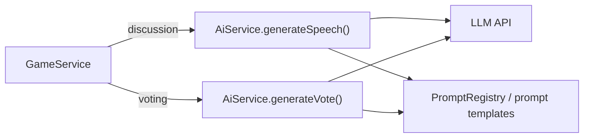

# AI 玩家交互流程

| 字段 | 内容 |
| --- | --- |
| 文档类型 | Design |
| 文档状态 | Active |
| 适用范围 | 普通对局中的 AI 玩家交互流程，以及同一实现中的模拟真人分支设计 |
| 目标读者 | 后端开发、评审者 |
| 责任人 | AI / Gameplay 维护者 |
| 最近核对日期 | 2026-06-15 |
| 关联代码 | `apps/api/src/game/game.service.ts`、`apps/api/src/ai/ai.service.ts`、`apps/api/src/ai/ai.types.ts`、`apps/api/src/ai/ai.personas.ts`、`apps/api/src/ai/prompts/` |
| 关联文档 | [游戏玩法](./Gameplay.md)、[AI 发言调度](./AI-Scheduling.md)、[AI 提示词缓存优化](./AI-Prompt-Cache-Optimization.md)、[AI 自动对抗调试房](../ai-iteration/AI-Auto-Adversarial-Match.md)、[AI 提示词自动对局评估自迭代：详细逻辑](../ai-iteration/AI-Prompt-Eval-Details.md) |

## 1. 背景

普通对局中的 AI 需要在两个约束下行动：

1. 从服务端权威状态中读取公开上下文，在讨论阶段发言、在投票阶段投票。
2. 尽量表现得像真人玩家，而不是规则引擎或自动脚本。

因此，AI 交互层既要满足玩法规则，也要兼顾调度、公平性、缓存效率、Prompt 可维护性和失败兜底。

## 2. 目标

- 让普通对局中的 AI 玩家按游戏阶段自动发言和投票。
- 保持房间级行为稳定，避免多个模型同时基于同一上下文抢话。
- 将“是否说、什么时候说、说什么”拆分为更可控的两层调用。
- 保证投票阶段符合同时盲投规则。
- 为复盘、评估闭环和缓存优化提供结构化上下文与调用日志。

## 3. 非目标

本文不覆盖以下内容：

- 调试自动对抗房的完整编排逻辑
- 复盘分析与提示词版本评估闭环
- Prompt 具体文案演化历史
- `ai.service.ts` 的未来模块拆分方案

## 4. 约束与假设

- 服务端是唯一可信状态源；阶段切换、投票写入和胜负判定都在服务端完成。
- 普通对局中 AI 身份对玩家隐藏，模型只能看到公开聊天、公开历史投票和自身短期记忆。
- AI 与模拟真人都属于“模型驱动玩家”；普通对局实际使用 AI 分支，模拟真人分支主要服务于调试自动对抗房。
- LLM 输出不可靠，可能超时、非 JSON、结构缺失或使用非法目标，因此必须由工程层做解析和兜底。
- 普通对局的聊天上下文优先服务于缓存复用，因此采用统一的公共视角，不做“你视角”重写。

## 5. 方案概览

### 5.1 组件关系



### 5.2 组件职责

| 组件 | 责任 |
| --- | --- |
| `GameService` | 触发阶段切换、选择候选玩家、构建 `GameContext`、写入发言和投票结果 |
| `AiService` | 构造 Prompt、调用模型、解析结果、记录调用日志、执行格式兜底 |
| `PromptRegistry` | 读取当前 active 代的 AI 提示词与人格库 |
| `ai.personas.ts` | 维护当前生效的人格集合与默认人格库 |
| `ai.types.ts` | 定义 `GameContext`、`AiSpeechStrategy`、`AiVoteAction` 等类型 |

## 6. 详细设计

### 6.1 发言流程

讨论阶段开始后，`GameService.afterDiscussionStarted()` 会启动模型驱动玩家的发言调度：

- 普通 AI 走 `startAiSpeech(room)`。
- 模拟真人走 `startSimulatedHumanSpeech(room)`；普通对局通常没有候选玩家，调试自动对抗房会实际使用这一分支。
- 调试自动对抗房的顺序发言走另一套串行循环，本文不展开。

#### 6.1.1 调度流程

```text
startModelSpeech(room, schedulerKind, initialDelayMs)
  -> 等待 delay
  -> 重新读取房间
  -> 非 discussion 阶段则停止
  -> 若同类调度器已有模型调用进行中，则最短延迟后重试
  -> 选择一个候选玩家
  -> 构建 GameContext
  -> 调用 aiService.generateSpeech(context)
  -> 校验返回时上下文是否失效
  -> speak: 等待剩余反应时间后落库
  -> skip: 记录 backoff
  -> finally: 按 nextCheckAfterMs 再次调度
```

#### 6.1.2 候选选择与公平性

普通 AI 候选集合满足：

- 玩家属于当前调度器
- 玩家处于存活状态
- 已过发言冷却
- 当前不在 `aiSkipBackoffUntil` 退避期

候选优先级如下：

1. 本轮未发言且本轮未被考虑过
2. 本轮未发言
3. 本轮未被考虑过
4. 所有候选

同一优先级内随机选择。

涉及字段：

| 字段 | 作用 |
| --- | --- |
| `aiLastConsideredRound` | 记录本轮是否已进入发言决策 |
| `aiLastConsideredAt` | 记录最近一次被调度的时间 |
| `aiSkipBackoffUntil` | skip 后短时间内避免再次选中 |

#### 6.1.3 上下文失效判断

普通模式下，发言上下文标记只包含：

```ts
{ roundNo, voteCount }
```

当模型返回后，只要出现以下任一情况就丢弃结果：

- 轮次变化
- 已离开发言阶段
- 投票数变化

普通模式下**新增聊天消息本身不会使上下文失效**。这是一个有意取舍：在 AI 与模拟真人分开调度后，如果“任意新聊天都失效”，模型调用会被频繁误杀。

#### 6.1.4 skip 与 backoff

当模型返回 `skip` 时：

- 标记本轮已考虑过该玩家
- 写入当前时间
- 设置 `aiSkipBackoffUntil = now + backoff`

普通 AI 的默认 backoff 为 `8_000ms`；模拟真人使用独立的更短退避常量。

### 6.2 发言生成：双层模型调用

普通 AI 发言采用两次模型调用：

1. **策略层**：决定是否发言、目标反应时间、下次观察时间和结构化策略。
2. **表达层**：把结构化策略转换为最终聊天文本。

流程如下：

```text
generateSpeech(context)
  -> buildSpeechStrategyPrompt()
  -> callModel(system-speech-strategy, user-speech-strategy-template)
  -> parseSpeechStrategyResult()
  -> 若 skip 则返回
  -> buildSpeechExpressionPrompt()
  -> callModel(system-speech-expression, user-speech-expression-template)
  -> parseSpeechResult()
  -> speak 或 skip
```

策略层输出示例：

```json
{
  "type": "speak",
  "targetResponseDelayMs": 2500,
  "nextCheckAfterMs": 10000,
  "strategy": {
    "replyTo": "3号说我机械",
    "speechAct": "防守反问",
    "publicPoint": "我只是催2号说句话，不足以说明机械",
    "tone": "有点不服，但别长篇解释",
    "maxSentences": 2,
    "constraints": ["不要同时点评多人"],
    "avoidPhrases": ["先看看大家反应", "带节奏"]
  }
}
```

表达层输出示例：

```json
{
  "type": "speak",
  "content": "啊？我就催一下2号，这也算机械吗"
}
```

### 6.3 投票流程

投票阶段开始后，`GameService.scheduleAiVotes()` 会为每个存活的模型驱动玩家设置错开延迟：

```text
delay = AI_VOTE_DELAY_MS + index * AI_VOTE_STAGGER_MS
```

每个玩家的投票流程：

```text
castAiVote(roomId, aiPlayerId)
  -> 获取最新房间
  -> 验证仍处于 voting
  -> buildGameContext()
  -> aiService.generateVote()
  -> 成功则 castVoteForPlayer()
  -> 失败则 chooseFallbackVoteTarget()
```

投票规则由工程层强制执行：

- 只能在投票阶段提交
- 只能投存活玩家
- 不能投自己
- 每轮每人只能投一次

### 6.4 投票兜底

模型投票失败时，服务端使用兜底逻辑：

- AI 玩家：优先投存活的 `human` 阵营玩家；若没有，则投其他存活玩家。
- 模拟真人：不偷看隐藏身份，优先参考已记录票数的最高票目标；没有明显趋势时随机投非自己存活玩家。

这保证了投票阶段不会因为模型超时或输出损坏而完全失效。

### 6.5 GameContext 设计

`GameService.buildGameContext()` 为每次模型调用构造统一输入：

| 字段 | 说明 |
| --- | --- |
| `roomId` | 房间 ID |
| `roundNo` | 当前轮次 |
| `phase` | 当前阶段 |
| `remainingTimeMs` | 当前阶段剩余时间 |
| `myPlayerId` / `myName` / `mySeatNo` | 当前玩家标识 |
| `myPlayerType` | `"ai"` 或 `"human"` |
| `mySimulated` | 是否模拟真人 |
| `myModelId` | 模型配置条目 ID |
| `myPersona` | 当前 AI 人格；模拟真人为 `null` |
| `alivePlayers` | 存活玩家的 `{ id, seatNo }` 列表 |
| `recentMessages` | 当前轮全部公开聊天 |
| `historicalMessages` | 历史轮次聊天 |
| `myLastSpeech` | 当前玩家最近一次发言 |
| `currentVoteCounts` | 当前轮投票计数 |
| `voteHistory` | 历史轮次投票摘要 |
| `shortMemory` | 当前玩家自己的投票短期记忆 |

设计约束：

- 除自己昵称外，其他玩家统一显示为“X号位”。
- `recentMessages` 使用当前轮全量消息，不使用滑动窗口。
- 投票 Prompt 中虽然存在 `currentVoteCounts`，但渲染为“同时盲投，当前票数不可见”。
- `shortMemory` 仅给自己看，不进入公开快照。

### 6.6 人格系统

当前默认人格库定义在 `apps/api/src/ai/ai.personas.ts`，包含 8 个默认人格：

| ID | 名称 | 摘要 |
| --- | --- | --- |
| `active_icebreaker` | 热心话痨型 | 冷场时更可能先开口 |
| `lazy_floater` | 划水摸鱼型 | 少说、敷衍、保守 |
| `snarky_joker` | 贫嘴玩笑型 | 爱玩梗和调侃 |
| `blunt_grumpy` | 暴躁直球型 | 说话直接、偏冲 |
| `emoji_fan` | 表情语气型 | 情绪外放、口头语多 |
| `shy_quiet` | 社恐慢热型 | 被动、慢热、惜字 |
| `serious_analyst` | 认真分析型 | 有信息时更愿意给具体判断 |
| `contrarian` | 杠精抬杠型 | 爱唱反调和反问 |

人格不是硬编码常量集合。运行时真实生效的是由 `PromptRegistry` 注入的 active 集合；`DEFAULT_AI_PERSONAS` 仅是播种内容和失败兜底。

### 6.7 Prompt 结构

#### 6.7.1 AI 玩家 Prompt 文件

目录：`apps/api/src/ai/prompts/ai-player/`

| 文件 | 作用 |
| --- | --- |
| `system-speech-strategy.txt` | 发言策略层系统提示词 |
| `user-speech-strategy-template.txt` | 发言策略层用户模板 |
| `system-speech-expression.txt` | 发言表达层系统提示词 |
| `user-speech-expression-template.txt` | 发言表达层用户模板 |
| `system-vote.txt` | 投票系统提示词 |
| `user-vote-template.txt` | 投票用户模板 |

#### 6.7.2 模拟真人 Prompt 文件

目录：`apps/api/src/ai/prompts/sim-human/`

- 发言：`system-sim-human-speech.txt` / `system-sim-human-speech-high.txt`
- 投票：`system-sim-human-vote.txt` / `system-sim-human-vote-high.txt`
- 用户模板：`user-sim-human-speech-template.txt`、`user-sim-human-vote-template.txt`

#### 6.7.3 缓存分层

AI 玩家模板使用 `<<CACHE_SPLIT>>` 划分缓存层：

1. 静态指令
2. 玩家固定信息
3. 轮内稳定信息
4. 最近聊天
5. 高频变化后缀

发送给 OpenAI-compatible 或流式接口前会移除该标记；Claude 请求会按层构造成 block。

### 6.8 模型协议与解析

#### 6.8.1 OpenAI-compatible

`AiService.buildOpenAiRequest()` 发送：

```json
{
  "model": "…",
  "temperature": 0.7,
  "messages": [
    { "role": "system", "content": "…" },
    { "role": "user", "content": "…" }
  ],
  "thinking": { "type": "enabled" },
  "reasoning_effort": "high"
}
```

#### 6.8.2 Claude Messages API

`AiService.buildClaudeRequest()` 发送：

```json
{
  "model": "…",
  "max_tokens": 1024,
  "temperature": 0.7,
  "system": "system prompt",
  "messages": [
    {
      "role": "user",
      "content": [{ "type": "text", "text": "…" }]
    }
  ]
}
```

若模型条目配置为 `claude`，`baseURL` 会被标准化为不带 `/v1` 的根地址，实际请求地址为 `{baseURL}/v1/messages`。

#### 6.8.3 JSON 容错解析

`AiService.extractJson()` 依次尝试：

1. 直接 `JSON.parse(text.trim())`
2. 从 Markdown 代码块中提取 JSON
3. 从文本中提取首个 `{...}` 对象

三者都失败时：

- 发言返回 `skip`
- 投票返回 `null`

## 7. 数据模型、接口与配置

### 7.1 核心类型

| 类型 | 说明 |
| --- | --- |
| `GameContext` | 模型调用的统一输入 |
| `AiSpeechStrategy` | 策略层输出的结构化发言策略 |
| `AiSpeechAction` | 发言动作：`speak` 或 `skip` |
| `AiVoteAction` | 投票动作 |
| `AiCallRecord` | 单次模型调用日志 |

### 7.2 关键调用类型

| `callType` | 触发场景 |
| --- | --- |
| `speech-strategy` | AI 发言策略层 |
| `speech-expression` | AI 发言表达层 |
| `vote` | AI 投票 |
| `sim-human-speech` | 模拟真人发言 |
| `sim-human-vote` | 模拟真人投票 |

### 7.3 关键配置

| 常量 | 默认值 | 说明 |
| --- | --- | --- |
| `AI_SPEECH_INITIAL_CHECK_MS` | `10_000` | 讨论开始后的首次观察延迟 |
| `AI_SPEECH_NEXT_CHECK_MIN_MS` | `1_000` | 发言观察最小间隔 |
| `AI_SPEECH_NEXT_CHECK_MAX_MS` | `30_000` | 发言观察最大间隔 |
| `AI_SPEECH_RESPONSE_DELAY_MIN_MS` | `800` | AI 发言最短反应时间 |
| `AI_SPEECH_RESPONSE_DELAY_MAX_MS` | `20_000` | AI 发言最长反应时间 |
| `AI_SPEECH_STALE_RETRY_MIN_MS` | `500` | 上下文失效后的最短重试延迟 |
| `AI_SPEECH_STALE_RETRY_MAX_MS` | `1_500` | 上下文失效后的最长重试延迟 |
| `AI_SPEECH_SKIP_BACKOFF_MS` | `8_000` | AI 返回 skip 后的退避 |
| `AI_VOTE_DELAY_MS` | `1_500` | 投票阶段首个模型驱动玩家的投票延迟 |
| `AI_VOTE_STAGGER_MS` | `1_200` | 多个模型驱动玩家之间的投票错峰 |
| `MESSAGE_LIMIT` | `240` | 单条发言上限 |

### 7.4 模型配置文件

根目录 `ai-models.json` 中每个模型条目支持以下关键字段：

| 字段 | 说明 |
| --- | --- |
| `id` | 模型配置标识 |
| `default` | 是否默认模型 |
| `format` | `openai` 或 `claude` |
| `baseURL` | API 根地址 |
| `apiKey` | 认证密钥 |
| `model` | 主模型名 |
| `temperature` | 温度 |
| `reasoningEffort` | 推理强度 |
| `thinking` | 是否发送 `thinking` 字段 |
| `timeoutMs` | 单次调用超时 |
| `expression.*` | 表达层覆盖项 |

## 8. 备选方案与取舍

| 决策 ID | 决策 | 备选方案 | 取舍理由 |
| --- | --- | --- | --- |
| `DEC-ROOM-SERIAL-SCHEDULING` | 房间级串行发言调度 | 多个 AI 并发生成 | 并发会导致多个 AI 基于同一上下文同时抢话，表现更机械，且更容易互相踩上下文 |
| `DEC-DOUBLE-STAGE-SPEECH` | 发言拆为策略层 + 表达层 | 单次模型直接产出最终发言 | 双层更容易约束“是否说、何时说、说什么”，也更利于调试和拟人化优化 |
| `DEC-STALE-CHECK-ROUND-AND-VOTES` | 普通模式下仅用 `roundNo + voteCount` 判定发言上下文失效 | 任意新聊天都视为失效 | 聊天变化过于频繁，会导致普通模式下大量调用被误丢弃 |
| `DEC-HIDE-LIVE-VOTE-COUNTS` | 投票 Prompt 固定隐藏实时票型 | 直接把 `currentVoteCounts` 暴露给模型 | 游戏规则要求同时盲投，模型不能读取本轮未公开票数 |
| `DEC-PUBLIC-SEAT-VIEW` | 聊天统一使用“X号位”公共视角 | 按当前玩家重写成“你/别人”视角 | 公共视角更利于跨玩家缓存复用，也降低上下文分叉 |
| `DEC-TOLERANT-JSON-EXTRACTION` | 对 JSON 输出做宽松提取 | 严格要求模型必须返回纯 JSON | 宽松解析能显著降低因模型输出包裹文字而导致的整次调用失败 |

## 9. 风险与失败模式

| 风险 | 触发条件 | 影响 | 缓解措施 |
| --- | --- | --- | --- |
| 模型超时 | 上游 API 慢或不可用 | 发言或投票缺失 | 超时后发言转 `skip`，投票走兜底 |
| 输出非法 | 非 JSON、字段缺失、目标非法 | 动作无法执行 | 工程层解析、校验并降级 |
| 上下文过期 | 模型返回前轮次或投票状态变化 | 旧上下文发言污染当前局势 | 保存前再次校验，失效则丢弃并短延迟重试 |
| 调度偏置 | 少数 AI 连续被选中 | 话语权分布不自然 | 使用“未发言 / 未考虑过”优先级和 skip backoff |
| 实现集中 | `ai.service.ts` 职责过重 | 后续修改成本高 | 目前通过类型和模板分层控制；模块拆分列入后续工作 |

## 10. 验证方式

建议用以下方式验证本设计：

1. **普通对局行为验证**  
   观察讨论阶段是否只有一个同类调度器实例在生成发言，且 AI 发言遵守冷却和阶段约束。
2. **投票规则验证**  
   检查投票阶段模型是否无法看到实时票型，且无自投、重复投票和对已出局玩家投票。
3. **失败兜底验证**  
   人工制造模型超时或非 JSON 输出，确认发言转 `skip`、投票走 fallback。
4. **复盘验证**  
   通过 `ai_call_logs`、Replay 导出和自动对抗房观察 Prompt、原始输出和最终落库行为是否一致。
5. **缓存验证**  
   查看模型日志中的缓存命中统计，确认 `<<CACHE_SPLIT>>` 分层生效。

## 11. 已知限制

- 普通模式下新增聊天消息不会使发言上下文失效；这是缓存与吞吐取舍，不代表绝对最自然。
- `ai.service.ts` 仍是集中式实现，发言、投票、协议适配和解析逻辑尚未拆分为独立模块。
- 投票时虽然 `GameContext` 计算了 `currentVoteCounts`，但普通对局模板中强制隐藏该信息；未来若规则改为公开票型，需要同时修改模板和说明文档。
- 当前日志会记录完整用户 Prompt 和模型原始返回，适合调试，但在更严格的数据治理场景下可能需要脱敏策略。

## 12. 后续工作

- 将 `AiService` 拆为更清晰的子模块，例如 `PromptBuilder`、`ModelClient`、`SpeechOrchestrator`、`VoteOrchestrator`。
- 在普通对局中引入更细粒度的上下文失效策略，区分“无信息新消息”和“实质新消息”。
- 为缓存优化增加前缀哈希、缓存命中率和 token 统计报表。
- 将关键设计决策逐步沉淀为独立 ADR，减少单篇设计文档过载。
